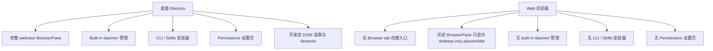

## 问题与范围

问题：当前仓库里，哪些功能仍然是 Electron 桌面客户端有、Web 客户端没有的？

范围：只看当前代码和仓库文档里的“已实现现状”，不推测未来计划；优先按用户可感知的产品能力归类，不把纯内部实现细节当成功能差异。

## 速答

当前仍然可以明确算作“桌面客户端有、web 端没有”的，主要是四类：

1. 完整内嵌浏览器能力：桌面端是 Electron `webview`；Web 端没有 browser tab 创建入口，历史/持久化 browser pane 只显示 desktop-only placeholder。
2. 内建桌面 daemon 的自管理：桌面端可以管理随 app 打包的 built-in daemon，包括启停策略、退出后是否继续运行、直接看日志和 `paseo daemon status` 输出。
3. 桌面集成安装器：桌面端可以在设置页里安装 CLI 和 orchestration skills；Web 端没有这组安装/更新/卸载入口。
4. 桌面权限面板：桌面端有专门的 Permissions 设置页，用来刷新/申请通知与麦克风权限并发送测试通知；Web 端没有这块设置入口。

可以作为补充但不建议放进主清单的是一项“开发态桌面专属”能力：Electron 浏览器面板里有 devtools 和 DOM element selector，并能把选中的页面元素附加成 `browser_element` 附件；Web 端没有对应 browser surface。

最近已经补到 Web、不要再算桌面独占的有两组：

- 本地 editor / file manager / 本地目录浏览。
- Pair device 配对链接获取。

## 关键证据

1. Workspace browser tab entry points are gated to Electron.
   - `packages/app/src/screens/workspace/workspace-screen.tsx:2337-2357`
   - `packages/app/src/screens/workspace/workspace-screen.tsx:3317`

2. Web `BrowserPane` renders a desktop-only placeholder rather than an iframe preview.
   - `packages/app/src/components/browser-pane.web.tsx:25-31`

3. Electron 端 `BrowserPane` 直接创建 `<webview>`，支持导航状态同步、真实加载事件和完整浏览器容器行为。
   - `packages/app/src/components/browser-pane.electron.tsx:375-403`
   - `packages/app/src/components/browser-pane.electron.tsx:479-491`

4. 设置页里 `Daemon / Integrations / Permissions` 都是 `desktopOnly` section，且 detail content 也只在 `isDesktopApp` 时渲染。
   - `packages/app/src/screens/settings-screen.tsx:136-143`
   - `packages/app/src/screens/settings-screen.tsx:1364-1373`

5. Daemon 设置页明确只操作 built-in desktop daemon，并暴露“管理 built-in daemon / 退出后继续运行 / 日志 / 完整状态输出”。
   - `packages/app/src/desktop/components/desktop-updates-section.tsx:227-297`
   - `packages/app/src/desktop/components/desktop-updates-section.tsx:397-452`
   - `packages/app/src/desktop/daemon/desktop-daemon.ts:113-145`

6. Integrations 设置页只在桌面桥存在时显示，并提供 CLI 安装、skills 安装/更新/卸载。
   - `packages/app/src/desktop/components/integrations-section.tsx:20-28`
   - `packages/app/src/desktop/components/integrations-section.tsx:123-170`
   - `packages/app/src/desktop/daemon/desktop-daemon.ts:215-220`

7. Permissions 设置页只在 Electron bridge 存在时显示，并提供 Notifications / Microphone 的刷新与申请入口。
   - `packages/app/src/desktop/permissions/desktop-permissions.ts:121-124`
   - `packages/app/src/desktop/components/desktop-permissions-section.tsx:70-97`

8. “本地 editor / file manager / 本地目录浏览” 已明确补到 browser local-direct 场景，不能再算桌面独占。
   - `docs/local-daemon-actions.md:15-23`
   - `docs/local-daemon-actions.md:33-38`

9. Pair device 也已支持 web 路径：桌面走 `getDesktopDaemonPairing()`，web 在 host 支持相应 feature 时走 `client.getDaemonPairingOffer()`。
   - `packages/app/src/desktop/components/pair-device-section.tsx:42-63`

## 细节展开

### 1. 仍然是主差异的功能

#### 完整 BrowserPane

这项差异现在就是“Web 端没有 browser tab surface，桌面端有完整 browser tab”。

- Web：不显示 New browser tab 入口；从脚本打开 service URL 时走外部浏览器；历史/持久化 browser pane 渲染 desktop-only placeholder。
- Electron：是真实 `webview` 容器，能拿到导航事件、标题、favicon，并拥有完整嵌入式浏览器行为。

对用户的直接体感差异是：Web 没有工作区内浏览器页签，桌面保留“工作区里的浏览器”。

#### Built-in daemon 自管理

Web 可以连接 daemon，也可以对 host 发 restart 请求；但这不等于 Web 具备“桌面 app 自带 daemon 的运维面板”。

当前只有桌面端有这整套 built-in daemon 生命周期入口：

- 是否让 Paseo 管理 built-in daemon
- 退出 GUI 后 daemon 是否继续常驻
- 直接查看 daemon logs
- 直接查看 `paseo daemon status` 的完整输出

这是 Electron 包装层和本地 IPC 能力，不是普通浏览器连接一个 host 就能等价替代的。

#### CLI / Skills 安装器

桌面端的 Integrations 页本质上是一个本机安装器：

- 安装 Paseo CLI
- 安装 / 更新 / 卸载 orchestration skills

这组动作会修改用户机器上的 CLI/skills 安装状态，因此当前实现只挂在桌面 bridge 上。Web 端没有等价 UI。

#### Permissions 设置页

虽然底层检查里会复用 Web Notification / Media APIs，但这一页的显示条件仍然是 `env.getDesktopHost() !== null`，也就是 Electron renderer 拿到桌面 bridge 之后才出现。

所以从产品现状看，这仍然是桌面端独有的设置面板，而不是普通 Web 端现成功能。

### 2. 次级差异：开发态 Electron 浏览器工具

Electron BrowserPane 在 `isDev` 下额外暴露两项能力：

- Open browser dev tools
- Select element，把页面元素抓成 `browser_element` 附件

证据在：

- `packages/app/src/components/browser-pane.electron.tsx:639-655`
- `packages/app/src/components/browser-pane.electron.tsx:658-760`
- `packages/app/src/components/browser-pane.electron.tsx:987-1007`

这更像开发辅助能力，不一定该和上面四项并列成“面向普通用户的产品差异”，但如果你在盘点 Electron bridge 价值，它算一项真实差异。

### 3. 不该再列为差异的项

#### 本地 desktop actions

最近 browser local-direct 已能：

- Open in editor
- Reveal in file manager
- 本地目录浏览并打开项目

所以这组能力不再是 Electron 独占，只是仍然受“必须本机直连 daemon”限制。

#### Pair device

`PairDeviceSection` 里已经支持两条路径：

- 桌面端走 `getDesktopDaemonPairing()`
- Web 端在 host 支持 `daemonStatusRpc` 时走 `client.getDaemonPairingOffer()`

因此它也不应继续被算成桌面独占。

## 未决问题

1. 这次结论按“当前用户可见功能”归类，没有把 titlebar、dock badge、fullscreen padding 这类桌面壳层差异列进主清单；如果你想做更细的“Electron shell 专属能力盘点”，需要单独再开一轮 explore。
2. “桌面权限面板”是否未来会开放给普通 Web，目前代码看不是；但这是未来设计问题，不属于本次现状结论。

## 后续建议

如果未来要补齐 Web 端服务预览能力，应该单独设计 daemon-backed service/port preview，而不是恢复泛用 iframe browser tab。第一版应围绕已注册、正在运行的 workspace service 建模，并明确 proxy、relay 和安全边界。

## 相关文档

- `docs/local-daemon-actions.md`
- `packages/app/src/screens/settings-screen.tsx`
- `packages/app/src/components/browser-pane.electron.tsx`
- `packages/app/src/components/browser-pane.web.tsx`
- `packages/app/src/desktop/components/desktop-updates-section.tsx`
- `packages/app/src/desktop/components/integrations-section.tsx`
- `packages/app/src/desktop/components/desktop-permissions-section.tsx`
