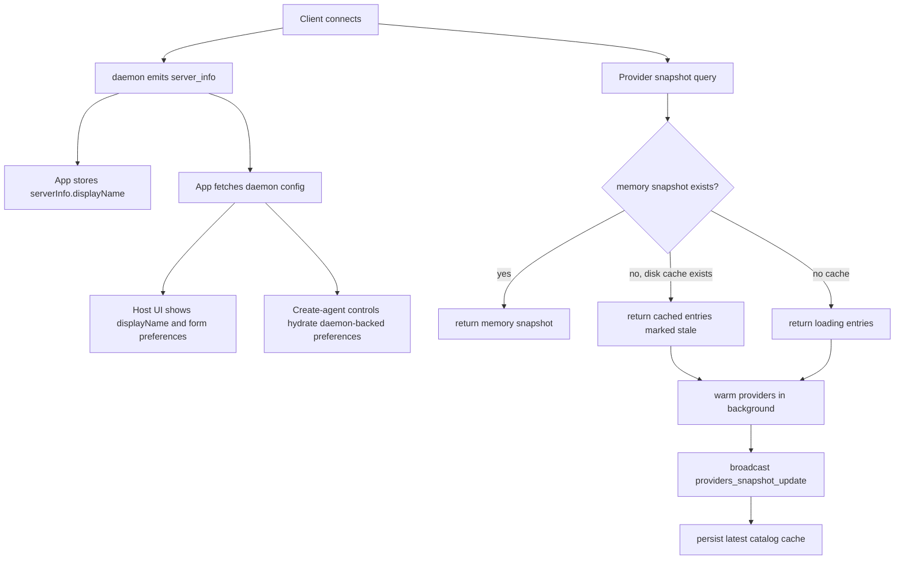

# daemon-synced-settings design

## 0. Requirement Summary

Users who open the web app from a new browser/device and connect to an existing daemon should be able to work immediately with the daemon identity, preferred agent models, favorite models, and recently discovered provider model lists already available.

Current confirmed scope:

- Move the editable daemon display label from browser-local host registry state to daemon-backed state.
- Move create-agent model preferences/favorites/defaults from browser-local storage to daemon-backed state.
- Persist provider snapshot model/mode/diagnostic knowledge on the daemon as a last-known bootstrap cache so a new client can render provider selectors immediately while refresh happens in the background.

Explicitly not in scope:

- Metadata generation settings for agent title, branch name, commit message, and PR text. The user verified these are already daemon-backed.
- Browser connection bookmarks, endpoint lists, local auth private keys, theme/font/send behavior, or other per-device UI preferences.
- Cloud/account sync between unrelated daemons.
- Treating cached provider readiness as permanently true. Cached snapshots are bootstrap data, not authority.
- Changing provider credential storage or provider auth flows.

Requirements input: no matching `.bytetrue/requirements/` document exists yet. This design treats the request as a concrete feature and leaves `requirement: null`.

## 1. Decisions And Constraints

This feature belongs at the daemon/client protocol boundary. The daemon already owns durable working state under `$PASEO_HOME`, while browser storage currently holds connection bookmarks and UI-only preferences. The change should move daemon capability state to daemon persistence without making every browser preference global.

Terminology:

- **Daemon display name**: user-editable label owned by the daemon. It is distinct from OS hostname and browser-local connection label.
- **Host profile label**: current browser-local label in `HostProfile.label`; after this feature it is only a fallback/bookmark label.
- **Agent form preferences**: create-agent defaults and favorites: selected provider, per-provider model/mode/thinking, feature values, and favorite models.
- **Provider catalog cache**: daemon-side last-known provider snapshot entries, including models, modes, status/error, labels, and timestamps.

Constraints:

- Protocol additions must be append-only: new fields optional, old clients still parse new daemon messages, and new clients still work against old daemons using existing behavior.
- New feature gates should live under `server_info.features.*` with `COMPAT(...)` comments at cleanup sites.
- Provider snapshot cache must not spawn provider processes on config replacement. Explicit refresh remains the user-facing path to re-probe providers.
- Settings refresh continues to clear in-memory provider knowledge, but the persistent last-known catalog remains a bootstrap seed until a new refresh overwrites it or the provider is removed.
- Cached catalog entries may include stale errors/diagnostics; UI must not present them as a successful fresh probe.

## 2. Design

### 2.1 Noun Layer

Current state:

- `HostProfile.label` is a browser-local field stored in the app host registry under `@paseo:daemon-registry`. `renameHost()` updates the local profile and `persistHosts()` writes it back to AsyncStorage. Sources: `packages/app/src/types/host-connection.ts`, `packages/app/src/runtime/host-runtime.ts`.
- `server_info` includes `serverId`, `hostname`, `version`, capabilities, and feature flags. It does not include a user-editable display name. Sources: `packages/server/src/server/websocket-server.ts`, `packages/app/src/stores/session-store.ts`.
- `MutableDaemonConfig` currently includes `mcp`, `providers`, `metadataGeneration`, `autoArchiveAfterMerge`, and `appendSystemPrompt`. Its patch path persists into `$PASEO_HOME/config.json` through `DaemonConfigStore`. Sources: `packages/protocol/src/messages.ts`, `packages/server/src/server/daemon-config-store.ts`.
- Create-agent preferences are app-only: `@paseo:create-agent-preferences` stores provider, providerPreferences, and favoriteModels. Sources: `packages/app/src/hooks/use-form-preferences.ts`, `packages/app/src/hooks/use-agent-form-state.ts`, `packages/app/src/composer/agent-controls/index.tsx`, `packages/app/src/hooks/use-draft-agent-features.ts`.
- Provider snapshots are process memory in `ProviderSnapshotManager`: `snapshots` and `providerLoads` are maps keyed by resolved cwd. Cold reads create loading entries and warm providers. Protocol entries already carry models, modes, status, error, enabled, labels, and `fetchedAt`. Sources: `packages/server/src/server/agent/provider-snapshot-manager.ts`, `packages/protocol/src/agent-types.ts`, `packages/protocol/src/messages.ts`.

Planned changes:

- Add daemon-backed display name:
  - Persisted config: `daemon.displayName?: string`.
  - Mutable config: `displayName: string` with `""` meaning no custom display name.
  - Server info: optional `displayName?: string | null` so the app can render the daemon label during handshake without waiting for a config query.
- Add daemon-backed agent form preferences:
  - Persisted config path: `agents.formPreferences?: { provider?, providerPreferences?, favoriteModels? }`.
  - Mutable config path: `agentFormPreferences` using the existing `FormPreferences` shape, normalized in protocol with optional fields and defaults.
  - App hooks should read/write daemon preferences for a selected serverId. Existing local storage remains only as a migration seed and fallback for old daemons.
- Add daemon provider catalog cache:
  - New server-side JSON store under `$PASEO_HOME/provider-snapshot-cache.json` or a similarly named private atomic file.
  - Shape: versioned record keyed by resolved snapshot scope (`home` plus bounded cwd keys), each with entries, generatedAt, persistedAt, and lastAccessedAt.
  - Entries reuse `ProviderSnapshotEntry` and add optional cache metadata such as `cacheState?: "live" | "cached"` and `cacheGeneratedAt?: string`. Existing clients ignore unknown fields; new clients can show stale state.
  - Cache is last-known bootstrap data. Refresh writes new entries after probe completion; provider removal/config membership changes prune removed provider ids from both memory and disk cache.

### 2.2 Orchestration Layer

Daemon display name flow:

- On daemon startup, `buildInitialMutableDaemonConfig()` reads `displayName` from persisted config.
- `server_info` includes `displayName` on handshake/status broadcasts.
- Host settings rename uses daemon config patch when the daemon supports this feature. The app updates local UI from the returned config/status and keeps `HostProfile.label` only as an offline fallback.
- A new browser connecting to the daemon receives `displayName` immediately in `server_info` and then sees the same value in `getDaemonConfig()`.

Agent form preferences flow:

- App code that currently calls `useFormPreferences()` should become server-aware: create flow and agent controls pass `serverId` and receive daemon-backed preferences when connected.
- Updating model/mode/thinking/favorite/feature values patches daemon config rather than AsyncStorage.
- One-time migration: when a client connects to a daemon with empty `agentFormPreferences`, it may upload existing local `@paseo:create-agent-preferences` once for that serverId, guarded by a local migration marker. It must not overwrite non-empty daemon preferences.
- Old daemons without the feature keep the existing local hook behavior.

Provider catalog flow:

- `ProviderSnapshotManager.getSnapshot(cwd)` first checks memory. If memory is cold, it asks the cache store for that resolved cwd.
- If cached entries exist, the manager seeds memory with cached entries marked stale/cached, returns them immediately, and schedules the normal warm-up probe.
- If no cache exists, existing loading-entry behavior remains.
- Refresh requests continue to call the explicit refresh path. A successful refresh updates memory, broadcasts, and writes the disk cache.
- Config replacement updates provider metadata and membership without probing. It also prunes removed providers from cached snapshots, but does not delete last-known entries for still-configured providers.

### 2.3 Mount Points

- Daemon mutable config contract: adding `displayName` and `agentFormPreferences` makes the feature visible through existing config RPCs.
- Server info handshake/status: adding `displayName` lets new clients show the daemon name before config fetch finishes.
- App host settings rename: switching rename from local `renameHost()` to daemon config patch removes browser-local label as canonical state.
- App create-agent and agent model controls: replacing app-local preferences with server-aware daemon preferences makes model defaults/favorites portable.
- Provider snapshot manager/cache store: seeding cold snapshots from disk makes model/mode lists immediately available to new clients.

If these mount points are removed, the feature disappears from user-visible behavior.

### 2.4 Rollout Strategy

1. Extend protocol/config nouns.
   - Exit signal: schemas parse old config/messages, new fields default safely, and `DaemonConfigStore` persists `displayName` plus `agentFormPreferences` to `$PASEO_HOME/config.json`.
2. Move daemon display name flow.
   - Exit signal: renaming a connected host writes daemon config and a fresh browser sees the same name via `server_info` or config fetch.
3. Move agent form preferences.
   - Exit signal: create flow, model controls, favorite toggles, thinking choices, and draft feature values read/write daemon-backed preferences for the selected server; local storage is only fallback/migration.
4. Add provider catalog cache store and manager seeding.
   - Exit signal: cold daemon/process or new web client receives cached model/mode entries immediately, then observes a refresh update when probing completes.
5. Update docs and targeted tests.
   - Exit signal: data model/provider architecture docs describe display name, agent form preferences, and provider catalog cache; targeted tests cover persistence, compatibility, migration, and cache refresh behavior.

### 2.5 Structure Health And Micro-Refactor

File-level assessment:

- `packages/app/src/runtime/host-runtime.ts` is already large and owns connection registry, controller lifecycle, probing, and mutations. Display-name canonicalization should avoid adding a large new responsibility here. Prefer a small helper/hook near daemon config or host presentation for resolving the display label.
- `packages/app/src/hooks/use-form-preferences.ts` is compact and test-covered. It can be split into shared schema/helpers plus local fallback/migration hook if daemon-backed preferences make the hook too branchy.
- `packages/server/src/server/agent/provider-snapshot-manager.ts` already owns snapshot orchestration. Adding disk I/O directly inside it would mix orchestration with persistence. Prefer a new `ProviderSnapshotCacheStore` class injected into the manager.
- `packages/server/src/server/daemon-config-store.ts` is focused on mutable config merge/persist. Adding two fields is a natural extension, but normalization helpers should stay small.

Directory-level assessment:

- Server persistence stores already live under `packages/server/src/server/` or adjacent utility modules. A new cache store belongs near provider snapshot code, not under generic utils, because its semantics are provider-specific.
- App hooks already hold user preference hooks under `packages/app/src/hooks/`. Keep preference hook exports there, but move reusable schema/types into a small shared module if both daemon-backed and local fallback code need them.

Decision: no standalone pre-feature micro-refactor is required. The implementation should add a new provider cache store rather than expanding the snapshot manager with file persistence, and may split `use-form-preferences.ts` only if the migration/fallback path makes the file hard to follow.

超出范围的观察: `search-yaml.py` currently fails under the available `python3` runtime because it uses `str | None` syntax unsupported by that interpreter. This blocks the recommended compound search path but is a tooling issue, not a prerequisite for this feature.

## 3. Acceptance Contract

Normal scenarios:

- Given a daemon with `daemon.displayName = "Studio Mac"`, when a brand-new browser connects, then host navigation and Host Settings show `Studio Mac` without requiring a local rename.
- Given Host Settings renames the daemon, when another browser connects to the same daemon, then it sees the new display name.
- Given a user selected Codex model/thinking/favorites on browser A, when browser B connects to the same daemon and opens create-agent controls, then the same defaults and favorites are available after daemon config loads.
- Given a daemon has previously refreshed provider snapshots, when a new browser queries provider snapshots, then model/mode selectors can render last-known entries before the live refresh completes.
- Given a cached provider entry is stale, when refresh completes successfully, then the app receives `providers_snapshot_update` and replaces stale entries with fresh data.

Boundary/error scenarios:

- Given a daemon has no display name, clients fall back to hostname or existing host registry label without writing a browser-local canonical label.
- Given daemon preferences are non-empty, local preference migration must not overwrite them.
- Given an old daemon lacks the feature flags, the app continues using existing local create-agent preferences and host label behavior.
- Given provider refresh fails after cached entries are returned, cached entries remain visible as stale/last-known and the latest error is observable.
- Given a provider is removed from config, cached entries for that provider stop appearing in future snapshots.

Explicit not-doing checks:

- No change to metadata generation settings for agent title, branch name, commit message, or PR text.
- No sync of browser auth private keys or admin password state.
- No sync of theme/font/send behavior settings.
- No implicit provider probing on config replacement.

Testing seam planning:

- Highest-level seam: daemon config RPC plus provider snapshot RPC through existing client/server request handlers.
- Red/green candidates:
  - `DaemonConfigStore` persists and reloads displayName and agentFormPreferences.
  - Host rename path patches daemon config and new `server_info` includes displayName.
  - ProviderSnapshotManager cold read seeds from injected cache store and still triggers background warm-up.
  - App preference hook uses daemon-backed preferences when feature is supported and falls back/migrates correctly for old daemons.
- Manual verification:
  - Browser A sets daemon name, favorites, and model defaults; Browser B fresh profile connects and sees them.
  - Provider settings page opens quickly using cached models, then refreshes status after live probing.

## 4. Architecture And Documentation Impact

Architecture docs to update during acceptance:

- `.bytetrue/architecture/data-model.md` and `docs/data-model.md`: add `daemon.displayName`, `agents.formPreferences`, and provider snapshot cache file under `$PASEO_HOME`.
- `.bytetrue/architecture/providers.md` and `docs/providers.md`: update Provider Snapshot Refresh Contract to describe disk-backed last-known bootstrap cache and how it interacts with settings refresh.
- `.bytetrue/architecture/ARCHITECTURE.md` and `docs/architecture.md`: mention daemon display name and daemon-backed create-agent preferences only if the architecture index needs a new note.

Protocol compatibility notes:

- Add optional fields only.
- Add feature flags such as `daemonDisplayName`, `daemonAgentFormPreferences`, and `providerSnapshotCache` with `COMPAT(...)` comments.
- Old clients should ignore new fields; new clients should gate new UX paths on feature flags.
