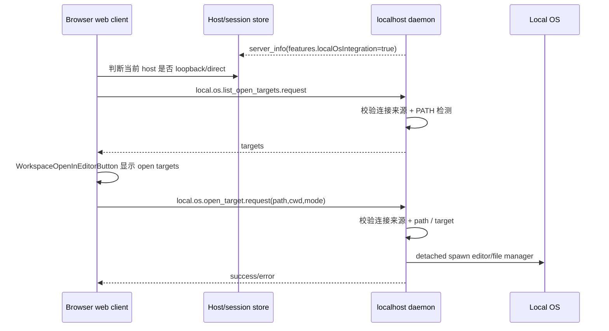
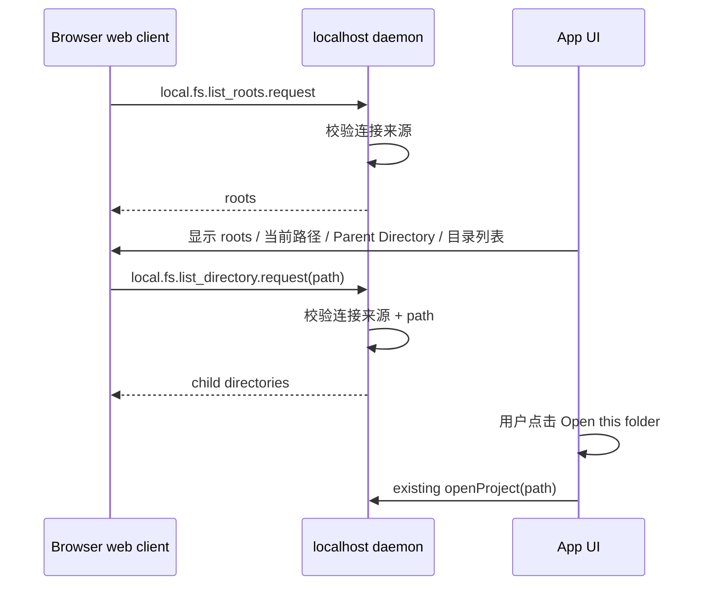

# localhost desktop actions design

## 0. 术语约定

| 术语                             | 定义                                                                                                                                                    | 防冲突结论                                                                                      |
| -------------------------------- | ------------------------------------------------------------------------------------------------------------------------------------------------------- | ----------------------------------------------------------------------------------------------- |
| 本机 daemon                      | 用户浏览器直接连接同一台机器上的 Paseo daemon，例如 `localhost` / `127.0.0.1`。它不同于 Electron 托管 daemon，也不同于 relay / 非 loopback direct TCP。 | 现有 `useIsLocalDaemon()` 只识别 Electron 托管 daemon，不能复用这个名字表达 browser localhost。 |
| 本机 OS integration              | daemon 代表用户执行本机 OS 动作，例如列出可用编辑器、打开编辑器、在文件管理器里 reveal 文件、枚举目录。                                                 | 不包含桌面窗口控制、更新、dock badge、Electron webview 等桌面 app 自身能力。                    |
| open target                      | 可打开目标：编辑器或文件管理器，形状为 `{ id, label, kind }`；打开时携带 `{ editorId, path, cwd?, mode? }`。                                            | 复用现有 `DesktopOpenTarget` 语义，不新增“editor target”之外的同义词。                          |
| daemon-backed directory picker   | browser localhost 使用的项目目录选择器：daemon 枚举本机目录，web UI 以类文件资源管理器方式让用户浏览并选择目录。                                        | 不等同于 Electron native directory dialog，也不是现有“手动输入路径 + 模糊推荐”的同义词。        |
| lite webview / local web preview | 后续能力：通过 daemon 代理本机 dev server / HTML，让远端或 browser web 快速预览 daemon 本机网页。                                                       | 与 Electron 完整 `<webview>` 分层：lite 版只做预览与打开，不承诺 devtools / 完整浏览器隔离。    |

## 1. 决策与约束

### 需求摘要

用户目标：当 web app 连接的是本机 `localhost` daemon 时，工作区里应出现桌面端已有的 “Open in editor / Reveal in file manager” 能力；打开项目目录时应能像文件资源管理器一样浏览 daemon 本机目录并选择项目。

成功标准：

- 浏览器直连本机 daemon 时，工作区按钮能列出本机可用编辑器 / 文件管理器目标，点击后在本机打开目标路径。
- 浏览器直连本机 daemon 时，Open Project 打开 daemon-backed directory picker，而不是继续停留在“只靠手动输入路径 + 模糊推荐”的体验。
- relay、远程 direct TCP、非 loopback 连接不显示本机 OS open targets / directory picker；即使伪造 RPC，daemon 也拒绝执行本机 OS / FS 动作。
- Electron 桌面仍保留原有 native directory dialog 和 Electron bridge 打开目标能力。
- 旧 daemon / 旧 client 仍可解析协议；新能力只通过 feature flag 和新 RPC 启用。

明确不做：

- 不把 CLI 安装纳入本功能。browser web 场景下假设 CLI 已安装；没有必要做成 localhost web 新能力。
- 不把 Electron-only 的 orchestration skills 文件安装器纳入本功能；它不同于 Web 端已有的 “Enable Paseo tools” MCP 注入开关。
- 不做 Electron 完整 browser tab / webview。
- 不为普通浏览器实现系统原生目录对话框；浏览器不能可靠给 daemon 返回本机绝对目录路径。
- 不给 relay / 远程连接开放 OS / FS 动作，即使客户端已经授权为普通 daemon operator。
- 不改变 GitHub open target 逻辑。

### 复杂度档位

- 健壮性 = L3（偏离内部工具默认 L2）：这是跨 WebSocket 的 OS / FS 动作入口，必须校验输入、拒绝非本机连接，并给出明确错误。
- 结构 = modules（偏离内部工具默认 functions）：不能继续把 OS/FS 计算逻辑塞进 `websocket-server.ts` / `messages.ts` 这类大文件，服务端需要独立 local 模块。
- 安全性 = validated（偏离内部工具默认未显式标注）：路径、target id、连接来源都要验证；环境变量不是安全边界。
- Compatibility = backward-compatible：新 RPC 使用 dotted namespace；`server_info.features.*` 加可选字段，旧端忽略。
- 可测试性 = tested：协议 schema、服务端 target 列举 / 打开分支、目录枚举、前端显示 gate 都适合自动化覆盖。

### 关键决策

1. **能力发现用全局 feature flag + 本地连接判定双 gate。**
   - daemon 在 `server_info.features.localOsIntegration` 表示“这个 daemon 版本支持本机 OS/FS integration RPC”。
   - client 还必须确认当前 host profile 是 loopback/direct localhost，才显示按钮和目录选择器。
   - 原因：`server_info` 目前由 `buildServerInfoStatusPayload()` 统一构造，不是 per-connection payload；安全不能只靠全局 flag。

2. **服务端 RPC 必须二次拒绝非本机连接。**
   - UI 不显示只是体验 gate；真正安全边界在 daemon。
   - relay / 非 loopback direct TCP 请求 `local.os.open_target.request` 或 `local.fs.list_directory.request` 时返回错误，且不 spawn / 不读目录。
   - 对齐 `.bytetrue/compound/decision/0001-daemon-client-authorization.md`：localhost / IPC 可作为普通 daemon operator traffic 的可信场景，远程 operator 不等同于能操作 daemon 本机 OS / FS。

3. **open target 计算放 daemon local-os service，Electron bridge 首版保持现状。**
   - 现有 Electron 实现在 `packages/desktop/src/features/editor-targets.ts`，逻辑可测试，但文件属于 desktop 包且注册了 Electron IPC。
   - 首版新增 `packages/server/src/server/local-os/...` 承载 daemon 侧 target 定义、PATH 检测和 spawn；保持 target id / label / kind 与 Electron 当前定义一致。
   - 不新增共享 workspace package，避免为了两个调用点引入更大结构变更。后续若目标定义继续增长，再抽 shared local-os 包。

4. **Open Project 在 browser localhost 下升级为 daemon-backed directory picker。**
   - 现有 `ProjectPickerModal` 的“输入路径 + 推荐”不是这次目标的最终 UX，只能作为高级路径输入 fallback。
   - 新目录选择器由 daemon 枚举目录，UI 显示 roots / 当前路径 / Parent Directory / 子目录列表 / Open this folder。
   - Electron native dialog 仅在 Electron runtime 使用；browser localhost 不走 `pickDirectory()`。

5. **CLI installer / orchestration skills installer 不进入本功能；Web 端 Paseo tools 已存在。**
   - 代码确认：截图里的 “Enable Paseo tools” 位于 `HostPage`，写入 daemon config 的 `mcp.injectIntoAgents`，含义是把 Paseo MCP tools 注入新 agent。它在普通 Web Host settings 中可用。
   - 另有 Electron-only `IntegrationsSection`，包含 CLI install 和 orchestration skills 文件安装 / 更新 / 卸载；这不是截图里的开关，也不是本功能要迁移的缺口。

6. **lite webview 作为后续独立能力，不混入 Phase 1。**
   - 产品定位认可：Electron 是完整 webview；browser web 可做 lite webview / local web preview。
   - 但它涉及 service proxy / iframe fallback / open-in-new-tab / dev server URL 管理，应该独立 feature 或 roadmap，不阻塞本功能。

## 2. 名词与编排

### 2.1 名词层

#### 现状

- `packages/app/src/workspace/desktop-open-targets.ts` 定义 `DesktopOpenTarget`、`OpenDesktopTargetInput`，并只通过 `getDesktopHost()?.editor` 调 Electron bridge。
- `packages/app/src/workspace/open-target-planner.ts` 根据 `desktopTargets`、`canUseDesktopBridge`、`isLocalExecution` 规划桌面目标与 GitHub 目标；桌面分支要求 `canUseDesktopBridge && isLocalExecution`。
- `packages/app/src/screens/workspace/workspace-open-in-editor-button.tsx` 使用 `useIsLocalDaemon(serverId)` + `useDesktopOpenTargets()` 决定按钮是否出现；普通 browser 下 `useIsLocalDaemon()` 恒为 false。
- `packages/desktop/src/features/editor-targets.ts` 定义内置目标：`Cursor`、`VS Code`、`WebStorm`、`Zed`、`Finder`、`Explorer`、`File Manager`，并负责 PATH 检测、路径校验和 detached spawn。
- `packages/app/src/hooks/use-open-project-picker.ts`：非 local daemon 打开 `ProjectPickerModal`，local daemon 走 Electron `pickDirectory()`。
- `packages/app/src/components/project-picker-modal.tsx` 已能通过 daemon `getDirectorySuggestions()` 获取目录建议，并通过 `openProject()` 打开路径，但它不是类文件资源管理器目录浏览体验。
- `packages/protocol/src/messages.ts` 的 `ServerInfoStatusPayloadSchema.features` 已有一组可选 feature flags。

#### 变化

新增 / 调整这些名词：

- `LocalOsOpenTarget`：沿用 `{ id, label, kind: "editor" | "file-manager" }` 形状，协议层命名不带 `Desktop`，避免 browser localhost 仍被叫成 desktop bridge。
- `LocalOsOpenTargetInput`：沿用 `{ editorId, path, cwd?, mode?: "open" | "reveal" }`，服务端负责验证 path 是绝对路径且存在。
- `LocalDirectoryEntry`：目录选择器列表项，至少包含 `{ name, path, kind: "directory", hidden? }`。
- `LocalDirectoryRoots`：目录选择器入口集合，例如 home、recent、workspace-adjacent、platform roots。
- `server_info.features.localOsIntegration?: boolean`：daemon 版本能力，不代表当前连接一定允许执行。
- `local.os.list_open_targets.request/response`：列出本机 daemon 可执行的 open targets。
- `local.os.open_target.request/response`：打开或 reveal 指定本机路径。
- `local.fs.list_roots.request/response`：列出目录选择器 roots。
- `local.fs.list_directory.request/response`：列出某个本机目录下的子目录。
- 前端 `useLocalOpenTargets` / 等价 facade：合并 Electron bridge 和 daemon-backed local OS integration，供 workspace 按钮读取。
- 前端 `LocalDirectoryPicker` / 等价 modal：browser localhost 的 Open Project 目录浏览 UI。
- 前端本地连接判定：新增“host URL 是 loopback/direct”的判断，不复用 Electron-only `useIsLocalDaemon()` 语义。

接口示例：

```ts
// 来源：packages/protocol/src/messages.ts ServerInfoStatusPayloadSchema
features: {
  localOsIntegration?: boolean;
}

// 来源：新增协议 RPC
{
  type: "local.os.list_open_targets.request",
  requestId: "req_1"
}
// ->
{
  type: "local.os.list_open_targets.response",
  payload: {
    requestId: "req_1",
    targets: [
      { id: "vscode", label: "VS Code", kind: "editor" },
      { id: "finder", label: "Finder", kind: "file-manager" }
    ],
    error: null
  }
}

// 来源：新增协议 RPC
{
  type: "local.os.open_target.request",
  requestId: "req_2",
  editorId: "vscode",
  path: "/repo/src/index.ts",
  cwd: "/repo",
  mode: "open"
}
// ->
{
  type: "local.os.open_target.response",
  payload: { requestId: "req_2", success: true, error: null }
}

// 来源：新增协议 RPC
{
  type: "local.fs.list_directory.request",
  requestId: "req_3",
  path: "/Users/byte/Work"
}
// ->
{
  type: "local.fs.list_directory.response",
  payload: {
    requestId: "req_3",
    path: "/Users/byte/Work",
    parentPath: "/Users/byte",
    entries: [
      { name: "paseo", path: "/Users/byte/Work/paseo", kind: "directory", hidden: false }
    ],
    error: null
  }
}
```

错误示例：

- `path` 非绝对路径 → `success: false` / `error: "Path must be an absolute local path"`。
- `editorId` 未知或 PATH 中不存在 → `success: false` / `error: "Open target unavailable: ..."`。
- 目录不存在或不可读 → directory response 携带明确错误，不泄漏额外敏感信息。
- 非本机连接请求 OS / FS 动作 → `rpc_error` 或 response error，且不 spawn / 不读目录。

### 2.2 编排层

#### Open target 流程



#### Directory picker 流程



#### 现状

- Electron path：renderer 通过 `window.paseoDesktop.editor.listTargets/openTarget` 调 main process IPC，再由 `packages/desktop/src/features/editor-targets.ts` spawn。
- Browser path：没有 `window.paseoDesktop`，`hasDesktopOpenTargetsBridge()` 为 false，`useDesktopOpenTargets()` 不列 targets。
- Local daemon 判定：`packages/app/src/hooks/use-is-local-daemon.ts` 只在 `shouldUseDesktopDaemon()` 时查询 desktop daemon serverId，非 Electron 直接返回 false。
- Project opening：browser 用 `ProjectPickerModal` 的输入/建议体验；Electron local daemon 用 `pickDirectory()` 原生 dialog。

#### 变化

- Daemon 启动时声明 `localOsIntegration` feature；协议 schema 接收这个可选 flag。
- Server session 处理新增 open target RPC 与 local fs directory picker RPC。
- Server handler 在执行前判断 connection 是否来自 loopback/local direct；非本机连接直接拒绝。
- App 新增 host-local 判断：基于 host runtime / host profile 的连接 URL 判断是否为 `localhost` / `127.0.0.1` / `::1` direct connection；relay 和非 loopback host 结果为 false。
- Workspace open button 改用 local open target facade：Electron runtime 仍走 Electron bridge；browser localhost 走 daemon RPC；远程只保留 GitHub target。
- Open Project 行为拆清：Electron runtime 继续调用 `pickDirectory()`；browser localhost 仍从 `useOpenProjectPicker` 打开 `ProjectPickerModal`，由 modal 在 local OS integration 可用时切到 daemon-backed directory picker；远程 / 不支持 local OS integration 的连接保留现有 Project Picker 输入/建议体验。

#### 流程级约束

- **错误语义**：list targets 失败时 UI 不显示 local open targets 或显示 toast；open target 失败时显示已有 toast 文案；目录枚举失败时在 picker 内显示错误并允许返回上一级 / 手动输入路径。
- **幂等性**：list targets 和 list directory 幂等；open target 是有副作用动作，但重复点击只会重复打开编辑器 / 文件管理器，不写持久状态。
- **并发**：多个 open target / directory list 请求互不共享状态；spawn detached 后立即返回。
- **兼容性**：旧 daemon 没 feature flag 时 app 不请求新 RPC；旧 client 忽略新 feature flag。
- **可观测性**：daemon 拒绝非本机连接、target 不存在、path 不存在 / 不可读应记录日志，便于区分安全拒绝与用户机器配置问题。

### 2.3 挂载点清单

- `server_info.features.localOsIntegration`：协议 feature flag — 新增。
- `local.os.list_open_targets.request/response`：WebSocket session RPC — 新增。
- `local.os.open_target.request/response`：WebSocket session RPC — 新增。
- `local.fs.list_roots.request/response`：WebSocket session RPC — 新增。
- `local.fs.list_directory.request/response`：WebSocket session RPC — 新增。
- Workspace open target UI：`WorkspaceOpenInEditorButton` 的 target provider — 修改为 Electron / daemon-backed local OS 两路。
- Open Project 入口：`useOpenProjectPicker` 保持 Electron native dialog / modal fallback 分支；`ProjectPickerModal` 新增 browser localhost directory picker 分支。
- 新 `LocalDirectoryPicker` UI：承载类文件资源管理器目录浏览体验。

### 2.4 推进策略

1. 协议骨架：新增 feature flag、open target RPC、local fs directory picker RPC schema。
   - 退出信号：协议 schema 测试能解析新 request / response，旧 `server_info` 仍可解析。
2. 服务端安全 gate：新增 local connection 判定 helper，并让 OS/FS RPC 先拒绝非本机连接。
   - 退出信号：本机连接可得到 stub response，非本机连接被拒绝且不执行 OS/FS 动作。
3. 服务端 open target 计算节点：实现 target 列举、PATH 检测、路径校验和 detached spawn。
   - 退出信号：单测覆盖可用目标、不可用目标、reveal 模式、非法 path。
4. 服务端 local fs 计算节点：实现 roots、目录枚举、不可读目录错误、隐藏目录标记。
   - 退出信号：单测覆盖 home/root、正常子目录、不可读目录、非绝对路径。
5. 前端 open target 接入：新增 local open target facade，workspace 按 Electron / browser localhost / remote 三种情况选择 target source。
   - 退出信号：组件测试覆盖 browser localhost 显示 daemon targets、remote 不显示 daemon targets、GitHub target 保持。
6. 前端 directory picker 接入：在 `ProjectPickerModal` 中实现 browser localhost directory picker，并保留 existing suggestions fallback。
   - 退出信号：hook / 组件测试覆盖 Electron native dialog 保持、browser localhost directory picker、fallback Project Picker。
7. 联调与验收：跑针对性测试、typecheck、lint，并手工验证至少一个本机编辑器、文件管理器 target 和目录选择打开项目。
   - 退出信号：自动化通过，手工记录目标列表、点击结果和目录选择结果。

### 2.5 结构健康度与微重构

##### 评估

- 文件级 — `packages/protocol/src/messages.ts`：约 4437 行，职责是全协议 schema。必须只加 schema 条目，不把 OS / FS 计算逻辑放进去。
- 文件级 — `packages/server/src/server/websocket-server.ts`：约 2456 行，已有 server_info 与 RPC 分发逻辑。只做 handler 挂接，不在此实现 PATH 检测 / spawn / fs 枚举。
- 文件级 — `packages/app/src/screens/workspace/workspace-open-in-editor-button.tsx`：约 319 行，职责集中在 open target UI，可接受 provider source 调整。
- 文件级 — `packages/app/src/workspace/desktop-open-targets.ts`：约 71 行，Electron bridge wrapper。首版可新增并行 local facade，避免强行改名造成大范围 churn。
- 文件级 — `packages/app/src/hooks/use-open-project-picker.ts`：约 30 行，分支简单；适合直接改成 Electron / browser localhost / fallback 三路。
- 文件级 — `packages/app/src/components/project-picker-modal.tsx`：现有路径输入/建议体验承担 Project Picker modal；本次在同一 modal 中拆出目录浏览子组件，避免另起 modal 后重复 open-project 状态管理。
- 目录级 — `packages/server/src/server`：约 129 个同层文件，已明显摊平；本次新增 server local-os / local-fs 文件时应放入子目录。
- 目录级 — `packages/app/src/workspace`：约 8 个文件，本次如新增 facade 文件不会明显加剧摊平。
- 目录级 — `packages/protocol/src`：约 53 个文件，但本次只改现有 schema/test，不新增协议子目录。

##### 结论：不做微重构，但新增 server 子目录隔离职责

本次不做“只搬不改行为”的微重构。原因：现有 Electron target 逻辑虽然可抽，但跨 `desktop` / `server` 抽共享包会扩大首版范围；workspace UI 文件未到必须拆分程度。服务端新增逻辑必须落进局部 local-os / local-fs 模块，这是新能力归属，不是对旧目录做重组迁移。

##### 超出范围的观察

- `packages/protocol/src/messages.ts` 和 `packages/server/src/server/websocket-server.ts` 体积长期偏大。若后续多个 feature 都继续在这里追加大块逻辑，建议另走 `bt-refactor` 做协议 schema 分组或 RPC handler 分发结构整理；本 feature 不阻塞。

## 3. 验收契约

### 关键场景清单

1. 输入：browser web 直连 `ws://127.0.0.1:{port}/ws` 且 daemon 支持 `localOsIntegration`。
   - 期望：workspace header 显示 open target 按钮，菜单含已安装编辑器 / 当前平台文件管理器。
2. 输入：在 browser localhost workspace 点击 `VS Code` / `Cursor` / 任一可用 editor target 打开工作区根目录。
   - 期望：daemon 返回 success，本机编辑器打开对应目录。
3. 输入：在 browser localhost workspace 当前 active file 存在，点击文件管理器 target。
   - 期望：daemon 以 reveal 模式定位该文件；不支持精确 reveal 的平台退化为打开父目录。
4. 输入：browser localhost 触发 Open Project。
   - 期望：打开类文件资源管理器 directory picker，显示 roots、当前路径、Parent Directory、子目录列表和 Open this folder；能通过点击目录逐层浏览并打开项目。
5. 输入：directory picker 访问不可读 / 不存在目录。
   - 期望：picker 内展示错误，允许返回上一级或手动输入路径；daemon 不崩溃。
6. 输入：browser 通过 relay 或非 loopback direct TCP 连接同一个 daemon。
   - 期望：UI 不显示 daemon-backed local OS targets / directory picker；伪造 RPC 也不会 spawn 本机进程或读取目录。
7. 输入：旧 daemon 不包含 `features.localOsIntegration`。
   - 期望：新 client 不发送新 RPC；UI 与现在一致，不报错。
8. 输入：target id 未知、PATH 中不存在、path 非绝对路径或不存在。
   - 期望：daemon 返回明确错误；UI toast 显示失败，不影响页面状态。
9. 输入：Electron 桌面触发 Open Project。
   - 期望：仍打开 native directory dialog，原桌面体验不退化。
10. 范围反向核对：代码中不应新增 CLI installer / orchestration skills installer RPC，也不应改动现有 Web 端 “Enable Paseo tools” MCP 注入开关或 Electron 完整 browser tab gate。

### 后续可行性备注（不进首版验收）

- **Paseo tools / CLI / skills：本次不做。** Web 端已有 “Enable Paseo tools” 开关，实际控制 `daemon.mcp.injectIntoAgents`，用于把 Paseo MCP tools 注入新 agent；这不是本功能缺口。Electron-only `IntegrationsSection` 里的 CLI installer 和 orchestration skills 文件安装器也不迁移到本功能中。
- **lite webview / local web preview：认可方向，建议独立 feature。** 目标是让 browser web 快速预览 daemon 本机 `localhost:{port}`、workspace dev server 或本地 HTML。优先做 service proxy + iframe/panel + open-in-new-tab fallback；与 Electron 完整 webview 分层，不承诺 devtools、完整 cookie/session 隔离或任意站点内嵌成功。

### 明确不做的反向核对项

- 不新增 CLI installer / orchestration skills installer RPC，也不改动 `mcp.injectIntoAgents` / “Enable Paseo tools” 开关。
- 不改 `showCreateBrowserTab = getIsElectron()` 这类 Electron 完整 browser tab gate。
- 不让 relay / 非 loopback 连接通过本机 OS / FS action handler。
- 不删除或改变 GitHub open target fallback。
- 不将 Electron window / dialog / browser / menu / update bridge 整体暴露给 browser localhost。

### 3.1 测试 seam / TDD 规划

- TDD 适用性：建议 TDD。协议兼容、安全 gate、路径校验、目录枚举和 UI gate 都是 regression-sensitive 行为。
- 最高层行为 seam：WebSocket RPC schema + server local-os / local-fs handler + `planWorkspaceOpenTargets` / workspace button target provider + `useOpenProjectPicker` 分支 + directory picker component。
- 优先 red/green 行为：
  1. 新协议 schema 能解析 `local.os.list_open_targets.*` / `local.os.open_target.*` / `local.fs.list_*` 与 `server_info.features.localOsIntegration`。
  2. 非本机连接调用 open target 或 directory list 时被拒绝且不 spawn / 不读目录。
  3. browser localhost 有 daemon targets 时 workspace button 出现；remote 没有 daemon targets 时不出现。
  4. browser localhost 触发 Open Project 走 directory picker；Electron 走 native dialog；unsupported remote 走 fallback Project Picker。
  5. directory picker 能浏览 roots、进入子目录、返回父目录、选择当前目录打开项目。
- 手工验证项：本机真实编辑器 / 文件管理器是否打开、目录选择器是否能打开真实项目，需要在至少一个平台手工 smoke；自动化只验证 spawn 参数、fs 枚举和分支。

## 4. 与项目级架构文档的关系

acceptance 阶段应更新 `.bytetrue/architecture/ARCHITECTURE.md` 或新增/更新相关 architecture doc，提炼以下系统级变化：

- Daemon 不再只负责 agent lifecycle，也提供受限的 local OS / FS integration RPC。
- Browser web 与 Electron desktop 在“本机 OS 打开能力”上共享用户体验，但执行通道不同：Electron bridge vs daemon RPC。
- Browser localhost 的项目目录选择由 daemon-backed directory picker 承担；Electron desktop 仍用 native directory dialog。
- 本机 OS / FS action 的安全约束：只允许 loopback/local direct 连接，远程授权客户端不自动获得 daemon 本机 OS / FS 操作权。
- lite webview / local web preview 是后续独立能力，与本 feature 的 local OS / FS action 分层。

如果实现中发现需要长期命名约定（例如 server 本机能力统一放 `server/local-*`），实现跑通后可考虑走 `bt-decide` 归档 convention。
