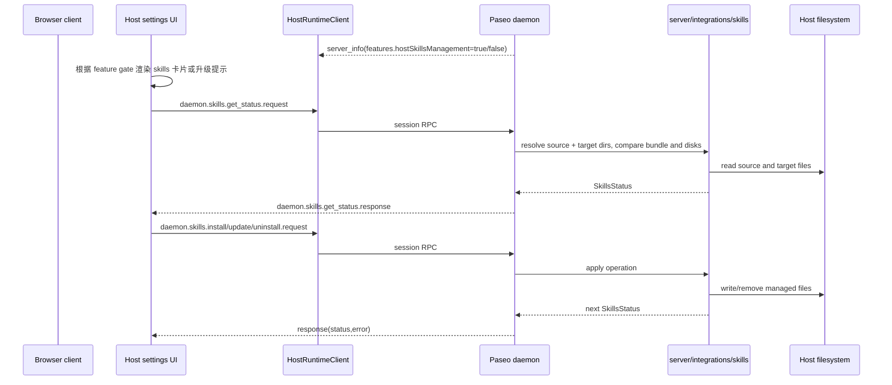

# web host skills management design

## 0. 术语约定

| 术语                        | 定义                                                                                            | 防冲突结论                                                                                     |
| --------------------------- | ----------------------------------------------------------------------------------------------- | ---------------------------------------------------------------------------------------------- |
| host skills management      | 针对某个已连接 daemon host 的 orchestration skills 状态查询与安装/更新/卸载操作。               | 它是 host 维护能力，不是客户端本机设置，也不是 agent 内部 skill catalog。                      |
| orchestration skills bundle | 仓库自带、受 Paseo 管理的一组 skills 目录，例如 `paseo`、`paseo-epic`、`paseo-loop`。           | 只指 managed bundle，不包含用户自己放进 `~/.codex/skills` 的任意第三方 skills。                |
| managed skills targets      | daemon 机器上的 `~/.agents/skills`、`~/.claude/skills`、`~/.codex/skills` 三处目标目录。        | 与 `Enable Paseo tools` 的 MCP 注入完全不同；这里操作的是磁盘文件，不是 agent runtime config。 |
| skills source dir           | daemon 用来读取 bundled skills 的源目录。开发态可指向 repo 根 `skills/`，打包态可指向资源目录。 | 当前 desktop 实现能定位到它，server standalone 形态默认还没有统一来源，必须单独设计。          |
| Enable Paseo tools          | `HostPage` 里的 `mcp.injectIntoAgents` 开关，控制是否把 Paseo MCP tools 注入新 agent。          | 这次功能不改它的 UI、文案、语义和后端行为；它不是 skills 安装器。                              |

## 1. 决策与约束

### 需求摘要

用户目标：在 Web 端连接 host 后，也能像桌面端一样查看该 host 的 orchestration skills 状态，并对其执行 Install / Update / Uninstall，而不需要切回 Electron。

成功标准：

- 支持该能力的 host 在 Web 的 host settings 中显示一张 host-scoped orchestration skills 管理卡片。
- 这张卡片能正确显示 `not-installed` / `up-to-date` / `drift`，并提供与状态匹配的 Install / Update / Uninstall 动作。
- Install / Update / Uninstall 真正作用于 daemon 所在机器上的 managed skills 目录，而不是浏览器所在机器。
- `Enable Paseo tools` 仍然单独存在并保持原义，用户不会再把它和 skills 安装器混淆。
- 旧 host、不支持 skills source 的 host 或未升级的 host，不会错误显示可操作入口。

明确不做：

- 不把 CLI installer 一起搬到 Web。
- 不把 root Settings 里的 Electron-only Integrations section 整体照搬到 Web；本能力改为 host-scoped，而不是 app-scoped。
- 不管理任意用户自定义第三方 skills，只管理 Paseo 自带 managed bundle。
- 不改变 `Enable Paseo tools` / `mcp.injectIntoAgents`。
- 不要求 local-direct localhost 才能使用；这是普通 daemon operator 维护能力，不按 local OS integration 的安全边界处理。

### 复杂度档位

- 健壮性 = L3（偏离默认）：动作会修改 host 机器上的磁盘文件，source dir 缺失、权限不足、bundle 不完整都要有明确失败语义。
- 结构 = modules（偏离默认）：当前纯逻辑落在 desktop 包里，Web 支持前必须把执行逻辑收回 daemon/server 层。
- 安全性 = validated（偏离默认）：这是普通 daemon operator 能力，但必须通过已授权连接和显式 feature gate 暴露，不能“前端猜测可用”。
- 兼容性 = backward-compatible：新能力通过 `server_info.features.*` 和新 dotted RPC 暴露；旧 host 不支持时 Web 只显示升级提示，不做降级模拟。
- 其余走当前 feature 默认档位。

### 关键决策

1. **把 skills 管理视为普通 daemon operator 能力，而不是 localhost-only 特权。**
   - `local.os.*` / `local.fs.*` 之所以只给 loopback，是因为它们直接代表 host 本机执行 OS / filesystem 动作。
   - orchestration skills 管理虽然也会写 host 文件，但语义更接近“管理 daemon 环境上的受控资源”，应遵循 authorized client 的普通 operator 权限模型。
   - 结果：relay 和非-loopback direct 的已授权客户端，只要连接到支持该能力的 host，就可以使用 Web skills 管理。

2. **能力发现通过 `server_info.features.hostSkillsManagement`，而不是复用 desktop runtime gate。**
   - 当前 desktop UI 用 `shouldUseDesktopDaemon()` 把 skills 卡片锁在 Electron。
   - Web 端需要改成“host 是否声明支持该能力”的 gate。
   - 结果：旧 host 或 skills source 不可用的 host 在 UI 上统一走“Update the host to manage orchestration skills from web.”，不散落兼容分支。

3. **执行逻辑必须搬进 daemon/server 包；Electron IPC 只保留薄包装。**
   - 现在真正做事的是 `packages/desktop/src/integrations/skills/operations.ts` 和 `sync.ts`，通过 desktop main process IPC 暴露。
   - Web 不能调用 Electron main，也不该再复制一份同样的 Node/FS 逻辑。
   - 结果：把纯 skills sync/status/remove 逻辑收进 `packages/server/src/server/integrations/skills/` 之类的 server scoped module；desktop IPC handler 和新的 WebSocket session RPC 都调用这套共享逻辑。

4. **daemon 必须显式知道 skills source dir；不能假设 server package 总能自己找到 bundle。**
   - 现状里 desktop 通过 `process.resourcesPath/skills` 或 repo 根 `skills/` 找到 bundle，但 `@bytetrue/server` 发布包并未包含 `skills/` 资源。
   - 首版若不设计 source dir，Web 入口会沦为 UI 空壳。
   - 结果：新增 daemon-side skills source resolver，优先读明确的 runtime source（推荐 `PASEO_SKILLS_SOURCE_DIR`）；其次读 server 包内同捆资源；开发态再退回 repo 根 `skills/`。resolver 失败时 host 不声明 `hostSkillsManagement`。

5. **Web 入口放进 host settings，而不是 root Settings。**
   - 桌面端当前的 Integrations section 是 app-scoped，本质上在改“当前这台 Electron 机器”的本地环境。
   - Web 场景下用户可能同时连接多台 host，技能安装必须是 per-host 的，不应挂在浏览器本地设置里。
   - 结果：在 `HostAgentsPage` 里，把 `Enable Paseo tools` 下方新增 host-scoped Orchestration skills card。

6. **这次做完整管理卡片，不只搬一个 Install 按钮。**
   - `Install`、`Update`、`Uninstall` 与 `SkillsStatus` 是同一套 host RPC 和同一套状态机。
   - 只暴露 Install 会让 drift / uninstall 留在 desktop-only，体验和实现都会分裂。
   - 结果：Web 首版直接覆盖状态查询 + install/update/uninstall 全套能力。

## 2. 名词与编排

### 2.1 名词层

#### 现状

- `packages/app/src/screens/settings/host-page.tsx` 的 Web host settings 里只有 `Enable Paseo tools` 卡片，它通过 `useDaemonConfig().patchConfig({ mcp: { injectIntoAgents } })` 修改 daemon config。
- `packages/app/src/desktop/components/integrations-section.tsx` 的 `Orchestration skills` 卡片只存在于 Electron root settings。
- `packages/app/src/desktop/hooks/use-install-status.ts` 里的 `useSkillsStatus()` 只会在 `shouldUseDesktopDaemon()` 为 true 时工作。
- `packages/app/src/desktop/daemon/desktop-daemon.ts` 只会通过 `invokeDesktopCommand("get_skills_status" | "install_skills" | "update_skills" | "uninstall_skills")` 打 Electron IPC。
- `packages/desktop/src/integrations/skills/operations.ts` / `sync.ts` 是纯 Node/FS 逻辑：比较 bundled skills 与三处 target 目录、同步文件、写 manifest、删除已托管条目。
- `packages/desktop/src/integrations/skills/paths.ts` 用 `process.resourcesPath/skills` 或 repo 根 `skills/` 作为 sourceDir；这个定位方式只有 Electron main process 知道。
- `packages/server/package.json` 当前 `files` 不包含 `skills/` 资源，standalone server 包没有现成 skills bundle。

#### 变化

新增 / 调整这些名词：

- `HostSkillsStatus`：沿用现有 `{ state: "not-installed" | "up-to-date" | "drift", ops: SkillOp[] }` 形状，不为 Web 另起状态名。
- `SkillOp`：继续沿用 `add` / `update` / `delete` 三种差异类型。
- `server_info.features.hostSkillsManagement?: boolean`：host 声明自己是否具备 Web 可用的 skills 管理能力。
- `daemon.skills.get_status.request/response`
- `daemon.skills.install.request/response`
- `daemon.skills.update.request/response`
- `daemon.skills.uninstall.request/response`
- `SkillsSourceResolution`：daemon 内部解析结果，至少含 `{ sourceDir, available }`，失败时不对 client 暴露 feature。
- `useHostSkillsStatus(serverId)`：Web host-scoped hook，替代 desktop-only `useSkillsStatus()`。
- `HostSkillsManagementCard`：挂在 Host > Agents 下的 UI 卡片；与 root settings 的 desktop Integrations section 分层。

接口示例：

```ts
// 来源：packages/protocol/src/messages.ts（新增）
features: {
  hostSkillsManagement?: boolean;
}

// 来源：新增 daemon session RPC
{
  type: "daemon.skills.get_status.request",
  requestId: "req_1"
}
// ->
{
  type: "daemon.skills.get_status.response",
  payload: {
    requestId: "req_1",
    status: {
      state: "drift",
      ops: [{ kind: "update", name: "paseo-epic" }]
    },
    error: null
  }
}

{
  type: "daemon.skills.install.request",
  requestId: "req_2"
}
// ->
{
  type: "daemon.skills.install.response",
  payload: {
    requestId: "req_2",
    status: { state: "up-to-date", ops: [] },
    error: null
  }
}
```

错误示例：

- host 不支持 `hostSkillsManagement`：客户端不发送新 RPC，并显示升级提示。
- source dir 不可解析：daemon 不声明 feature；若状态在运行中丢失，RPC response `error` 给出可读诊断。
- target 目录不可写：install/update/uninstall response 返回明确错误，不吞掉具体原因。

### 2.2 编排层



#### 现状

- Desktop path：renderer -> `invokeDesktopCommand()` -> Electron main -> desktop `integrations/skills` module -> host filesystem。
- Web path：没有任何 skills management RPC，也没有 host feature flag，因此在 host settings 中不存在这项能力。
- daemon runtime：只负责 MCP 注入、daemon config、agent/session/worktree 等；不掌握 bundled skills source dir。

#### 变化

- daemon bootstrap 阶段解析 host skills source capability。解析成功时在 `server_info.features.hostSkillsManagement` 声明 true；失败则不声明。
- Session 增加四个新的 host-scoped RPC，全部通过已连接的 daemon client session 执行。
- RPC handler 不做 localhost-only gate；只依赖现有 daemon client authorization。也就是说，已授权 relay / remote direct 客户端可以执行。
- handler 调用 server scoped `integrations/skills` module。module 负责 source/target dir 解析、status diff、manifest-aware sync 和 remove。
- Electron desktop 的现有 IPC handler 改为调用同一套 shared server module，保持桌面行为不变。
- App 新增 host-scoped hook 和卡片：feature flag true 时读状态并渲染动作；flag false 时显示“Update the host to manage orchestration skills from web.” 的非操作态提示。
- `Enable Paseo tools` 卡片继续原样存在在 skills 卡片上方，不合并，不互相驱动。

#### 流程级约束

- **安全语义**：skills 管理按普通 daemon operator 权限处理，不新建 localhost-only 特例；但前提仍是连接已完成授权。
- **幂等性**：重复 `get_status` 纯幂等；`install` / `update` 在已 `up-to-date` 时应返回相同状态；`uninstall` 在已 `not-installed` 时应返回稳定结果。
- **托管边界**：只修改 Paseo managed skill 名单和 manifest 覆盖到的文件，不删除无关自定义 skills。
- **source 可用性**：当 daemon 解析不到 skills source bundle 时，不暴露 feature，不让 Web 误判成“可装但失败”。
- **兼容性**：旧 host 不支持 feature flag 时，Web 只展示升级提示；不 fallback 到 desktop IPC 或其它旧 RPC。
- **可观测性**：source dir 解析失败、target 写入失败、manifest 删除跳过等都要打 daemon log，便于区分“host 不支持”与“host 坏了”。

### 2.3 挂载点清单

- `server_info.features.hostSkillsManagement`：host 能力声明 — 新增。
- `daemon.skills.get_status.request/response`：WebSocket daemon session RPC — 新增。
- `daemon.skills.install.request/response`：WebSocket daemon session RPC — 新增。
- `daemon.skills.update.request/response`：WebSocket daemon session RPC — 新增。
- `daemon.skills.uninstall.request/response`：WebSocket daemon session RPC — 新增。
- Host > Agents：`HostPage` 新增 `HostSkillsManagementCard` — 新增。
- daemon runtime source resolution：新增 `PASEO_SKILLS_SOURCE_DIR` / package-relative fallback 解析入口 — 新增。
- desktop IPC handlers：`get_skills_status/install_skills/update_skills/uninstall_skills` 改为委托 shared server module — 修改。

### 2.4 推进策略

1. 微重构：抽出 daemon/desktop 共用的 skills sync 逻辑与 Web host card 组件
   退出信号：desktop 原有 skills 行为仍能通过共享模块工作，`host-page.tsx` 不再内联新增大块 skills UI。
2. 协议骨架：加 feature flag、四个 `daemon.skills.*` RPC schema 和 host runtime client 方法
   退出信号：App 能对支持型 host 发出有类型约束的 skills 状态请求。
3. daemon 执行层：补 source resolver、shared server skills module、session handlers、desktop IPC 委托
   退出信号：daemon integration tests 证明 get/install/update/uninstall 能在临时 home 上收敛到正确状态。
4. Web UI：在 Host > Agents 渲染 skills 卡片 / 升级提示，并接入 query + mutation + toast
   退出信号：支持型 host 在 Web 上可操作，不支持型 host 只显示升级提示，`Enable Paseo tools` 不受影响。
5. 文档与验证：补 architecture / development / API 文档，跑 targeted tests
   退出信号：相关文档可解释 capability gate 与 source bundle 约束，测试和静态检查通过。

### 2.5 结构健康度与微重构

##### 评估

- 文件级 — `packages/app/src/screens/settings/host-page.tsx`：已承载多张 host cards 和多段状态逻辑，继续把 skills 管理 UI 内联进去会让职责更混。
- 文件级 — `packages/desktop/src/integrations/skills/operations.ts`：行数不大，但职责是 daemon/host filesystem 同步，不是 Electron UI 专属逻辑。
- 文件级 — `packages/desktop/src/integrations/skills/sync.ts`：纯文件同步/manifest 逻辑，与 desktop runtime 无关。
- 目录级 — `packages/server/src/server/`：已经存在 `local-os/`、`local-fs/` 这种 scoped integration module 模式；skills 管理当前缺少对应 scoped module。
- 目录级 — `packages/app/src/screens/settings/`：仍可承载单一 host card 组件，不需要额外大规模重组。

##### 结论：微重构（重组目录）

##### 方案

- 搬什么：
  - 把 `packages/desktop/src/integrations/skills/operations.ts` 和 `sync.ts` 的纯技能同步逻辑搬到 `packages/server/src/server/integrations/skills/`。
  - 把 `host-page.tsx` 中新增的 skills 卡片 UI 提炼为独立组件文件，不内联在现有大文件里。
- 搬到哪：
  - server 侧新目录：`packages/server/src/server/integrations/skills/`
  - app 侧新组件：`packages/app/src/screens/settings/host-skills-management-card.tsx`
- 行为不变怎么验证：
  - desktop IPC 仍调用同一套共享逻辑，现有 desktop skills tests 继续绿。
  - shared module 用临时目录测试 source/target 差异、manifest 删除和 idempotency。
  - host-page 其余 cards 的可见性和交互测试不受影响。
- 步骤序列（provable refactor）：
  1. 提取 shared `SkillsStatus` / `SkillOp` / sync 操作到 server scoped module，desktop handler 仅改 import。
  2. 为 shared module 补临时目录 unit tests，确保 desktop 现有语义零偏差。
  3. 把 Web skills card 抽成独立组件，再接入 host-page。

##### 建议沉淀的 convention

- 是否稳定模式：稳定模式
- 规则一句话：凡是“修改连接 host 上受 Paseo 管理资源”的执行逻辑，默认落在 `packages/server/src/server/` scoped module，由 Electron IPC 或 WebSocket session 复用；不要把纯 host-side 执行逻辑继续埋在 desktop 包里。
- 适用范围：本仓库 server / desktop host management 相关能力
  → 建议 implement 跑通后走 `bt-decide` 归档。

##### 超出范围的观察

- CLI installer 目前仍是 desktop-only 本机环境安装动作，若未来也要上 Web，应单独做 feature，而不是在本功能里顺手并入。

## 3. 验收契约

- 支持 `hostSkillsManagement` 的 host 连接到 Web 后，Host > Agents 出现 `Orchestration skills` 卡片；不支持的 host 只显示升级提示或不显示动作按钮。
- `Enable Paseo tools` 卡片仍独立存在，切换 `mcp.injectIntoAgents` 不会改变 skills 状态，也不会触发 skills 安装。
- `not-installed` host 在 Web 上点击 Install 后，managed bundle 被同步到 host 的三处 target 目录，返回 `up-to-date`。
- `drift` host 在 Web 上点击 Update 后，drift 被修复，返回 `up-to-date`。
- `up-to-date` host 在 Web 上点击 Uninstall 后，Paseo managed skills 被移除，回到 `not-installed`，但无关的用户自定义 skills 保留。
- relay / remote direct 的已授权客户端可以执行这组动作；它们不走 local-only gate。
- daemon 无可用 skills source bundle 时，不会错误宣称支持该功能。
- desktop app 原有 skills 卡片行为保持不变；Web 新能力不引入对 Electron IPC 的依赖。
- 代码中不应新增对 CLI installer 的 Web 挂载点。
- 代码中不应改动 `Enable Paseo tools` 对 `mcp.injectIntoAgents` 的现有语义和写入路径。

### 3.1 测试 seam / TDD 规划

- TDD 适用性：适合。它是典型的“共享文件系统逻辑 + 协议封装 + UI capability gate”组合，能通过高层可观察行为稳定验证。
- 最高层行为 seam：
  - server：shared skills module + daemon session RPC
  - app：Host settings card on top of `server_info.features.hostSkillsManagement`
- 优先 red/green 行为：
  1. `get_status` 在 clean/drift/up-to-date 三种目录状态下返回正确 `SkillsStatus`。
  2. `install/update/uninstall` 通过 daemon session RPC 作用到临时 home 目录，并收敛到目标状态。
  3. Web Host > Agents 在 feature flag true/false 两种 host 上渲染正确 UI，且 `Enable Paseo tools` 仍单独存在。
- 手工验证项：
  - 用一台真实 desktop-managed daemon 作为 host，从浏览器远程连接后执行 install/update/uninstall。
  - 在一个不支持该功能的旧 host 上确认只出现升级提示，没有错误按钮。

## 4. 与项目级架构文档的关系

- **名词**：`hostSkillsManagement` feature flag、host-scoped skills management RPC、skills source resolver 应回写 architecture 的 daemon capability / host management 边界。
- **动词骨架**：Browser host settings -> daemon session RPC -> shared skills module -> host filesystem 这条主流程需要补进 architecture 的 host management 能力图。
- **流程级约束**：这项能力属于 ordinary daemon operator traffic，而不是 localhost-only 本机 OS integration；这个权限边界需要在 architecture 或相关 API 文档里明确。
- 相关文档：
  - `docs/architecture.md`
  - `docs/development.md`（若新增 `PASEO_SKILLS_SOURCE_DIR`）
  - 新增或更新 daemon skills management API 文档
