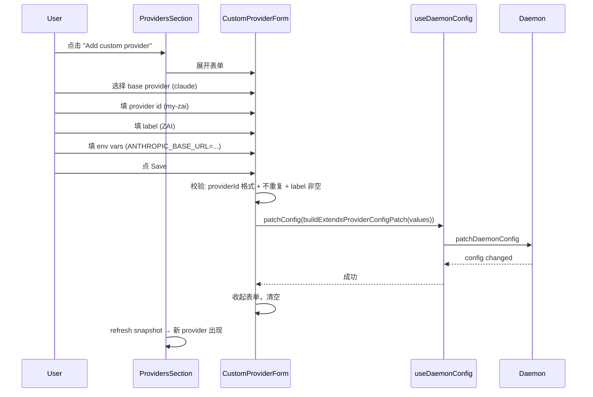

# custom-provider-form design

## 0. Terminology

| 术语                      | 定义                                                                              | 反冲突结论                                                                                                                                                                                                                                       |
| ------------------------- | --------------------------------------------------------------------------------- | ------------------------------------------------------------------------------------------------------------------------------------------------------------------------------------------------------------------------------------------------ |
| **extends-provider**      | 通过 `extends` 继承内置 provider 并叠加自定义 env/command/models 的 provider 条目 | 和 ACP provider（`extends: "acp"`）是两类；ACP 已有 UI，本 feature 只做 extends 内置 provider 的。注意：现有文档中 "custom provider" 是统称（含 ACP + extends + binary override），本设计用 "extends-provider" 特指 extends 内置 provider 的子集 |
| **base provider**         | 被 extend 的内置 provider                                                         | 即 `ProviderOverride.extends` 的值，有效值为 `claude` / `codex` / `pi` / `opencode` / `copilot` / `omp`。OMP 默认 disabled，本 feature 第一版在 base provider 列表中包含 OMP                                                                     |
| **provider config patch** | `MutableDaemonConfigPatch` 中 `providers` 字段的写操作                            | 已有 `patchConfig` API，本 feature 复用，不新增 RPC                                                                                                                                                                                              |

## 1. Decisions and Constraints

### Requirement summary

让用户在 Paseo 前端 Settings → Providers 页面通过表单创建 `extends: "claude"` 类型的自定义 provider，替代手动编辑 `~/.paseo/config.json`。

**目标用户**：想用第三方 API endpoint（Z.AI、Qwen、OpenRouter 等）但不想手写 JSON 的 Paseo 用户。

**成功标准**：用户选择 base provider → 填 label + env vars → 点保存 → provider 出现在列表中，可正常启用和使用。

**明确不做**：

- 不编辑已有 custom provider（第一版只做创建）
- 不做 provider 导入/导出
- 不做 env var 值的敏感信息掩码/加密存储
- 不改变 `MutableDaemonConfigPatchSchema` 或 `ProviderOverrideSchema` 的协议定义（它们已经完整）
- 不做 ACP provider 创建（已有 `ProviderCatalogList` 处理）
- 不做 `command`（自定义 binary）、`params`、`additionalModels`、`order` 字段的 UI（第一版只做 env + models + disallowedTools）

### Complexity dimension

使用默认组合，无偏离。

### Key decisions

1. **复用 `patchConfig` API**：`useDaemonConfig().patchConfig` 已支持 `providers` 字段的 partial update。表单提交时构造 `MutableDaemonConfigPatch`，与 ACP provider 的 `buildAcpProviderConfigPatch` 模式一致。
   - 备选：新增专用 RPC。否决——`patchConfig` 已足够，新增 RPC 只是包一层。

2. **表单放在 "Add provider" section 内**：在现有 `ProviderCatalogList` 上方加一个 "Custom provider" 入口（按钮或展开区域），点击后展开表单。
   - 备选：独立页面/弹窗。否决——设置页已有 section 分组模式，内联展开更符合现有 UI 惯例。

3. **base provider 选择用 segmented control 或简单列表**：6 个内置 provider（claude/codex/pi/opencode/copilot/omp），不需要搜索。
   - 备选：复用 `CombinedModelSelector`。否决——那是选 model 的，语义不同。

4. **env vars 用动态 key-value 列表**：用户可添加多行 `KEY=VALUE`。简单直接，不需要预设字段。
   - 备选：按 provider 预设常用 env var 字段（如 Claude 预设 `ANTHROPIC_BASE_URL`）。可做但非必须，第一版用自由 key-value 更灵活。
5. **Claude 第三方 endpoint 自动提示 `disallowedTools`**：当 base provider 为 claude 时，表单默认勾选 `disallowedTools: ["WebSearch"]`（用户可取消）。这是 `docs/custom-providers.md:617-633` 记录的已知 gotcha——第三方 Anthropic-compatible API 不支持 WebSearch 工具。

## 2. Terms and Orchestration

### 2.1 Term Layer

#### Current state

`ProviderOverrideSchema`（`packages/protocol/src/provider-config.ts:46-58`）已定义完整结构：

```ts
// source: packages/protocol/src/provider-config.ts ProviderOverrideSchema
// 注意：extends 和 label 在 schema 层面是 optional，
// 但对非内置 provider 的必填约束由 ProviderOverridesSchema.superRefine 强制
{
  extends?: string;       // 内置 provider id 或 "acp"（非内置必填）
  label?: string;         // 显示名（非内置必填）
  description?: string;
  command?: string[];     // 自定义 binary
  env?: Record<string, string>;
  params?: Record<string, unknown>;
  models?: ProviderProfileModel[];
  additionalModels?: ProviderProfileModel[];
  disallowedTools?: string[];
  enabled?: boolean;
  order?: number;
}
```

`MutableDaemonConfigPatchSchema`（`packages/protocol/src/messages.ts:174-188`）已支持 `providers` 和 `removeProviders`：

```ts
// source: packages/protocol/src/messages.ts MutableDaemonConfigPatchSchema
{
  providers?: Record<string, Partial<MutableDaemonProviderConfigSchema>>;
  removeProviders?: string[];
  // ...
}
```

`buildAcpProviderConfigPatch`（`packages/app/src/hooks/use-acp-provider-catalog.ts:11-25`）展示了构造 patch 的模式：

```ts
// source: packages/app/src/hooks/use-acp-provider-catalog.ts buildAcpProviderConfigPatch
return {
  providers: {
    [entry.id]: {
      extends: "acp",
      label: entry.title,
      description: entry.description,
      command: [...entry.command],
      env: entry.env ? { ...entry.env } : {},
    },
  },
};
```

#### Change

新增一个 helper 函数 `buildExtendsProviderConfigPatch`，与 `buildAcpProviderConfigPatch` 平行：

```ts
// 新增: packages/app/src/hooks/use-acp-provider-catalog.ts (或新文件)

interface ExtendsProviderFormValues {
  providerId: string; // 用户填的 provider id（如 "my-zai"），提交前 trim
  extends: string; // base provider（claude/codex/pi/opencode/copilot/omp）
  label: string; // 提交前 trim，拒绝纯空白
  description?: string;
  env: Array<{ key: string; value: string }>; // key 提交前 trim，空 key 过滤
  models?: Array<{ id: string; label: string; isDefault?: boolean }>;
  disallowedTools?: string[]; // Claude 第三方 endpoint 默认 ["WebSearch"]
}

function buildExtendsProviderConfigPatch(
  values: ExtendsProviderFormValues,
): MutableDaemonConfigPatch {
  const env: Record<string, string> = {};
  for (const { key, value } of values.env) {
    if (key.trim()) env[key.trim()] = value;
  }
  return {
    providers: {
      [values.providerId]: {
        extends: values.extends,
        label: values.label,
        description: values.description || undefined,
        env: Object.keys(env).length > 0 ? env : undefined,
        models: values.models?.length ? values.models : undefined,
        disallowedTools: values.disallowedTools?.length ? values.disallowedTools : undefined,
      },
    },
  };
}
```

### 2.2 Orchestration Layer

#### Main flow



#### Current state

`providers-section.tsx:612-623` 的 "Add provider" section：

```tsx
// source: packages/app/src/screens/settings/providers-section.tsx:612-623
{hasServer && isConnected ? (
  <SettingsSection title="Add provider" ...>
    <ProviderCatalogList
      serverId={serverId}
      installingProviderId={installingProviderId}
      onInstall={handleInstall}
    />
  </SettingsSection>
) : null}
```

`handleInstall`（L541-558）调用 `patchConfig(buildAcpProviderConfigPatch(entry))` 然后 `refresh`。

#### Change

在 `ProviderCatalogList` 上方插入 "Custom provider" 入口：

1. 一个按钮 "Add custom provider"，点击后展开内联表单
2. 表单字段：
   - **Base provider**：segmented control / radio list（claude / codex / pi / opencode / copilot / omp），默认 claude
   - **Provider ID**：text input，trim 后校验 `/^[a-z][a-z0-9-]*$/`，检查不与已有 provider 重复
   - **Label**：text input，trim 后必填（拒绝纯空白）
   - **Description**：text input，选填
   - **Env vars**：动态 key-value 列表，每行 key 和 value 分别输入（非单行 `KEY=VALUE`），有添加/删除按钮。key trim 后为空的行过滤掉
   - **Disallowed tools**：当 base provider 为 claude 时默认勾选 `WebSearch`（可取消）；其他 provider 不显示此项
   - **Models**（可选高级）：折叠区域，动态列表，每行 id + label + isDefault checkbox
3. 提交时调用 `patchConfig(buildExtendsProviderConfigPatch(values))`，成功后 refresh snapshot
4. 错误处理：providerId 重复 → inline error；网络错误 → Alert

#### Flow-level constraints

- **幂等性**：同一 providerId 重复提交 → daemon 端 `patchConfig` 是 merge 语义，第二次提交会覆盖；前端应拦截重复 id
- **错误语义**：校验失败 → inline error message，不关闭表单；API 失败 → Alert + 表单保持打开
- **Provider ID 校验**：前端 trim 后校验格式 `/^[a-z][a-z0-9-]*$/`，daemon 端 `ProviderOverridesSchema` 已有相同校验
- **Label 校验**：trim 后非空，拒绝纯空白字符串
- **重复提交防护**：提交中 disable Save 按钮，防止 double-submit
- **取消行为**：表单有 "Cancel" 按钮，点击后收起表单并清空（不提交）

### 2.3 Mount-Point Inventory

| Mount point                              | Location                                                                              | Action |
| ---------------------------------------- | ------------------------------------------------------------------------------------- | ------ |
| Custom provider form component           | `packages/app/src/screens/settings/custom-provider-form.tsx`（独立组件文件）          | add    |
| `buildExtendsProviderConfigPatch` helper | `packages/app/src/hooks/use-custom-provider-form.ts`（独立 hook 文件）                | add    |
| Form mount in providers section          | `packages/app/src/screens/settings/providers-section.tsx` — "Add provider" section 内 | add    |

### 2.4 Rollout Strategy

```text
1. static structure: CustomProviderForm 组件骨架 + placeholder → 表单在设置页可见
   exit signal: 点击 "Add custom provider" 展开表单，所有字段可交互
2. interaction logic: 表单校验 + 提交流程 → 填完点 Save 触发 patchConfig
   exit signal: 合法输入提交后 provider 出现在列表中；非法输入显示 inline error
3. state integration: 成功后 refresh snapshot → 新 provider 立即可用
   exit signal: 新 provider 在列表中显示正确的 status/model count
4. edge cases + polish: 重复 id 拦截、env var 空行过滤、loading 状态
   exit signal: 所有 edge case 有正确的 UI 反馈
```

### 2.5 Structural Health and Micro-refactor

#### Evaluation

- **file level** — `packages/app/src/screens/settings/providers-section.tsx`：~720 行，职责为 provider 列表 + metadata generation settings + ACP add flow + provider removal。本 feature 若内联表单会再增加 ~150 行，使文件突破 850 行且混合第 4 种职责。应将表单提取为独立组件。
- **file level** — `packages/app/src/hooks/use-acp-provider-catalog.ts`：~33 行，职责为 ACP catalog 数据 + `buildAcpProviderConfigPatch`。新增 `buildExtendsProviderConfigPatch` 会混入不同职责。应新建独立文件。
- **directory level** — `packages/app/src/screens/settings/`：当前 10 个文件，本 feature 新增 1 个组件文件。`packages/app/src/hooks/`：已有大量 hooks，新增 1 个不会造成扁平化问题。

#### Conclusion: micro-refactor, split files + extract component

1. `buildExtendsProviderConfigPatch` 和表单类型不应放入 `use-acp-provider-catalog.ts`（职责不同），应新建 `packages/app/src/hooks/use-custom-provider-form.ts`。
2. 表单 UI 不应内联在 `providers-section.tsx`（该文件已有 3 种职责，再加表单会突破 850 行），应提取为独立组件 `packages/app/src/screens/settings/custom-provider-form.tsx`。

##### Plan

- **what to move**：
  - `buildExtendsProviderConfigPatch` + `ExtendsProviderFormValues` 类型 → `packages/app/src/hooks/use-custom-provider-form.ts`
  - 表单 UI（`CustomProviderForm` 组件）→ `packages/app/src/screens/settings/custom-provider-form.tsx`
- **where**：上述两个新文件
- **how unchanged behavior verified**：新文件无现有行为；`use-acp-provider-catalog.ts` 和 `providers-section.tsx` 仅增加 import + 挂载点
- **step sequence**：
  1. 创建 `use-custom-provider-form.ts`，放入 `ExtendsProviderFormValues` 类型和 `buildExtendsProviderConfigPatch` 函数
  2. 创建 `custom-provider-form.tsx`，放入 `CustomProviderForm` 组件
  3. 在 `providers-section.tsx` 中 import 并挂载

## 3. Acceptance Contract

### Key scenarios

| #   | Scenario                                                                                                   | Expected result                                                                                |
| --- | ---------------------------------------------------------------------------------------------------------- | ---------------------------------------------------------------------------------------------- |
| 1   | 选择 claude，填 id=`my-zai`，label=`ZAI`，env `ANTHROPIC_BASE_URL=https://api.z.ai/api/anthropic`，点 Save | provider `my-zai` 出现在列表中，status 为对应状态，`disallowedTools: ["WebSearch"]` 已自动写入 |
| 2   | 不填 label，点 Save                                                                                        | inline error "Label is required"，不提交                                                       |
| 3   | 填 id=`claude`（与内置重复），点 Save                                                                      | inline error "Provider ID already exists"                                                      |
| 4   | 填 id=`My-Provider`（大写），点 Save                                                                       | inline error "Provider ID must be lowercase..."                                                |
| 5   | 填合法数据，但 daemon 返回错误                                                                             | Alert 弹窗显示错误信息，表单保持打开                                                           |
| 6   | 添加 3 个 env var，其中 1 个 key 为空                                                                      | 空 key 的行被过滤，只提交 2 个有效 env var                                                     |
| 7   | 不填 models                                                                                                | provider 使用 base provider 的默认 models                                                      |
| 8   | 填 2 个 models，其中一个标记 isDefault                                                                     | provider 显示自定义 model 列表                                                                 |
| 9   | 填 id 为空字符串，点 Save                                                                                  | inline error "Provider ID is required"                                                         |
| 10  | 填 label 为纯空格，点 Save                                                                                 | inline error "Label is required"（trim 后为空）                                                |
| 11  | 填 id=`my-zai`（与已有 custom provider 重复），点 Save                                                     | inline error "Provider ID already exists"                                                      |
| 12  | 提交中再次点击 Save                                                                                        | 按钮 disabled，不触发重复提交                                                                  |
| 13  | 填完表单后点 Cancel                                                                                        | 表单收起并清空，不提交任何 patch                                                               |
| 14  | 选择 codex（非 claude），表单不显示 disallowedTools                                                        | 仅 claude base provider 显示 WebSearch 选项                                                    |
| 15  | 选择 claude，手动取消 WebSearch 勾选                                                                       | 提交的 patch 不含 `disallowedTools` 字段                                                       |

### Reverse-check items for explicit non-goals

- 代码中不存在编辑已有 custom provider 的 UI 入口
- 代码中不存在 provider 导入/导出功能
- 代码中不存在 `command`、`params`、`additionalModels`、`order` 字段的表单输入
- `ProviderOverrideSchema` 和 `MutableDaemonConfigPatchSchema` 定义不变

### 3.1 Test Seam / TDD Plan

- **TDD applicability**: 适用。表单校验逻辑和 `buildExtendsProviderConfigPatch` 是纯函数，适合单元测试。
- **Highest behavior seam**: `buildExtendsProviderConfigPatch(values)` 函数——输入表单值，输出 `MutableDaemonConfigPatch`
- **Priority red/green behaviors**:
  1. `buildExtendsProviderConfigPatch` 正确构造 patch（含 env vars 转换、空值过滤、disallowedTools）
  2. providerId 格式校验（合法/非法/重复/空字符串）
  3. label trim 校验（非空/纯空白拒绝）
- **Manual verification items**: 完整 UI 流程（展开表单 → 填写 → 提交 → 列表刷新）、claude base provider 默认 disallowedTools 行为、非 claude base provider 不显示 disallowedTools

## 4. Relationship with Project-Level Architecture Docs

- **terms**: 无新增系统级术语
- **verb skeleton**: 无跨模块流程变更
- **flow-level constraints**: 无新增跨 feature 约束

此 feature 的变更局限在 `packages/app/src/screens/settings/` 和 `packages/app/src/hooks/`，无系统级可见影响。acceptance 阶段无需回写架构文档。
