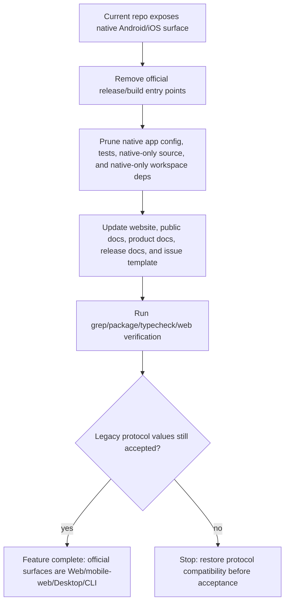

# Remove the official native Android/iOS client surface

## 0. Terminology

- **Native mobile client surface**
  - Definition: the official iOS/Android app surface: Android/iOS build scripts, Expo native app config, EAS/Fastlane/TestFlight/App Store/APK release paths, native-only app files, native-only test flows, and native-only workspace packages.
  - Anti-conflict conclusion: this does **not** mean mobile web. In this repo, `mobile` is also used for compact/mobile-web layout state and protocol/device legacy values, so implementation must not grep-delete every `mobile` string.

- **Mobile web / PWA**
  - Definition: the browser-hosted app running on a phone-sized viewport, backed by `packages/app` Expo web output and the deployed Web app.
  - Anti-conflict conclusion: must remain supported. Code terms such as `mobileView`, compact layout, mobile sheets, and phone-sized responsive UI usually belong here and should stay unless they are native-only.

- **Shared app renderer**
  - Definition: `packages/app` as the Expo web / React Native Web renderer used directly in the browser and bundled into Electron desktop.
  - Anti-conflict conclusion: `packages/app` is not the native mobile client by itself. Removing native mobile must not remove this package or the desktop renderer path.

- **Legacy mobile protocol values**
  - Definition: protocol/client activity values such as `clientType: "mobile"`, heartbeat `deviceType: "mobile"`, `register_push_token`, and server-side push-token handling.
  - Anti-conflict conclusion: these become compatibility-only protocol inputs after this feature. New official clients should not register Expo push tokens or promise native push-notification behavior, but the daemon/protocol should continue parsing these legacy messages so old clients or fork clients do not fail to connect solely because this cleanup landed.

Grep checks found current native-client surface in package scripts, `packages/app/app.config.js`, `packages/app/eas.json`, `scripts/release-android-apk-local.sh`, `docs/android.md`, `docs/mobile-testing.md`, `docs/release.md`, website download/copy files, native-only app files, Maestro flows, and `packages/expo-two-way-audio`.

Historical reference: commit `f56ba57f` previously removed this surface. Use it as a reference shape, not a blind revert, because current ByteTrue fork release behavior and website links have changed since then.

## 1. Decisions and Constraints

### Requirement summary

Build outcome: Paseo’s official client surfaces become browser Web, mobile web/PWA, Electron desktop, and CLI. Native Android/iOS app maintenance and distribution are removed from official code, docs, release checklists, website download paths, and native-only source/dependency surfaces.

Success looks like:

- Users no longer see Android APK, iOS, TestFlight, App Store, EAS, or native app install paths as official supported surfaces.
- Maintainers no longer have Android/iOS build scripts, APK upload scripts, native test flows, EAS config, or native-only app packages in the normal workspace.
- `packages/app` still builds for Web and remains the shared renderer for desktop.
- Mobile web/compact responsive behavior remains intact.
- Protocol/server compatibility with older clients is not broken by removing accepted message values.

Explicit non-goals:

- Do not delete `packages/app`.
- Do not delete mobile web / PWA responsive UI.
- Do not remove Electron desktop.
- Do not remove CLI.
- Do not remove or narrow WebSocket protocol enums/messages just because official native clients are gone.
- Do not keep app-side Expo push-token registration as an official path; compatibility lives on the daemon/protocol side, not in new official clients.
- Do not rewrite compact layout code merely because variable names contain `mobile`.
- Do not remove daemon relay, pairing, or phone-browser usage language when it refers to mobile web/PWA rather than native app distribution.

### Complexity dimension

Use the project-internal cleanup default: L2 robustness, modules-level organization, reasonable performance, team readability, active evolution, logged/testable verification.

Deviations:

- **Compatibility = backward-compatible**: protocol schemas and server handlers must continue accepting legacy `mobile`/push-token messages. Official app behavior should stop using them, but the daemon should not reject old clients solely because this cleanup landed.
- **Determinism = reproducible**: completion must be proven by targeted grep checks, package graph checks, lint/typecheck, web build/typecheck, and relevant release utility tests.
- **Structure = modules**: this change spans release scripts, app config/package graph, native-only source, website copy, and docs; it should be sliced by ownership area rather than one giant grep-delete.

### Key decisions

1. **Full native-client prune, not release-only cleanup**
   - Chosen by user in this design stage.
   - Alternative rejected: only hiding Android/iOS downloads while leaving native source/deps and Maestro tests around. That would reduce user-facing promises but still leave the low-ROI maintenance burden.

2. **Keep protocol compatibility, but remove official client usage**
   - `packages/protocol/src/messages.ts` currently accepts `clientType: "mobile"` and heartbeat `deviceType: "mobile"`.
   - Removing those enum values would violate the repo’s protocol contract. The official app should not register Expo push tokens after this cleanup, but the daemon/protocol can continue accepting `register_push_token` from old clients or forks.
   - This compatibility does not mean Paseo still supports native mobile as an official surface.

3. **Use delete/simplify before inventing replacements**
   - This feature removes a surface; it should not introduce a new feature flag, fallback distribution mode, or alternative native build path.
   - If community native builds are mentioned at all, they are explicitly unsupported experiments, not a hidden official path.

4. **Docs and website are part of the product boundary**
   - It is not enough to delete scripts. Website download UI, public docs, issue templates, and release docs must stop advertising native mobile support.

5. **Do not rename mobile-web layout terms in this feature**
   - Names like `mobileView`, compact layout, mobile sheet, mobile tab menu, and phone mockups can continue to mean “phone-sized UI / mobile web”.
   - Renaming all of them would be a separate terminology refactor and would add risk without directly removing the native client surface.

### Prerequisite dependencies

None.

## 2. Terms and Orchestration

### 2.1 Term Layer

#### Current state

- **Release target vocabulary**
  - `package.json` exposes root Android/iOS scripts: `android`, `android:development`, `android:production`, `android:release`, `android:clear`, `android:clean`, `ios`.
  - `packages/app/package.json` exposes app-level Android/iOS scripts and keeps `eas-cli` in dev dependencies.
  - `scripts/release-version-utils.mjs` accepts `android-v...` retry tags.
  - `scripts/release-android-apk-local.sh` builds and uploads APK assets.
  - `docs/release.md` lists Android APK build/upload steps in beta/stable completion checklists.

- **Expo native app vocabulary**
  - `packages/app/app.config.js` contains `APP_VARIANT`, EAS project ID/owner handling, iOS bundle config, Android package/permissions/adaptive icon config, native plugins, and notification config.
  - `packages/app/eas.json` defines development/production/production-apk build and submit profiles.

- **Native-only app implementation vocabulary**
  - `packages/app/src` contains `.native`, `.ios`, and `.android` files for terminal webview, markdown text, native audio, native attachment/file handling, native drag/sort behavior, and iOS hardware keyboard behavior.
  - `packages/app/src/hooks/use-push-token-registration.ts` registers Expo push tokens.
  - `packages/app/src/app/pair-scan.tsx` uses native camera scanning.
  - `packages/expo-two-way-audio` is a native iOS/Android Expo module workspace used by native voice runtime.
  - `packages/app/maestro/` contains native mobile E2E flows.

- **Official surface copy**
  - `docs/product.md`, `docs/architecture.md`, `docs/android.md`, `docs/mobile-testing.md`, `docs/release.md`, `README.md`, `SECURITY.md`, `public-docs/*`, and website components describe Android/iOS/native mobile support in multiple places.
  - `packages/website/src/downloads.tsx` exposes `androidApk`.
  - `packages/website/src/routes/download.tsx` renders Android APK and iOS rows.
  - `.github/ISSUE_TEMPLATE/bug-report.yml` includes iOS app and Android app as bug-report surfaces.

- **Legacy protocol vocabulary**
  - `packages/protocol/src/messages.ts` accepts `clientType: "mobile"` and heartbeat `deviceType: "mobile"`.
  - `packages/client/src/daemon-client.ts` exposes `registerPushToken` and accepts mobile client type.
  - Server tests and handlers cover mobile heartbeat/push notification behavior.

#### Change

- **Remove official native release terms**
  - Delete Android/iOS npm scripts from root and app package manifests.
  - Remove `eas.json`.
  - Remove local APK release script and `android-v...` retry-tag vocabulary from release utilities and docs.
  - Remove EAS/APK/TestFlight/App Store references from release docs/checklists.

  Example:

  ```ts
  // source: scripts/release-version-utils.mjs normalizeReleaseTag

  // before:
  normalizeReleaseTag("android-v0.1.93") -> "v0.1.93"

  // after:
  normalizeReleaseTag("android-v0.1.93") throws Unsupported release tag
  ```

- **Collapse app config to Web/desktop-shared config**
  - Keep Expo config needed for web export: name, slug, version, icon/favicon, scheme, web output, autolinking, `expo-router`, typed routes, React compiler.
  - Remove iOS/Android/EAS/native permission/plugin/build-profile config from official app config.

  Example:

  ```ts
  // source: packages/app/app.config.js default export

  // before:
  expo.ios / expo.android / expo-notifications / expo-camera / expo-audio / EAS extra

  // after:
  expo.web + shared Expo web/router config only
  ```

- **Prune native-only implementation terms**
  - Delete native-only files and native-only route/screen entries when they are not needed by web/desktop.
  - Remove native push-token registration from the official app path.
  - Remove native-only workspace package `packages/expo-two-way-audio` from workspaces/build graph.
  - Remove native-only dependencies no longer imported after the prune.

  Example:

  ```ts
  // source: packages/app/src/contexts/session-context.tsx SessionProvider

  // before:
  useClientActivity(...)
  usePushTokenRegistration(...)

  // after:
  useClientActivity(...)
  // no Expo push token registration from official app
  ```

- **Keep mobile-web terms**
  - Leave compact/mobile layout state such as `mobileView`, mobile sheets, mobile tab menus, responsive phone UI, and phone-sized marketing screenshots unless the text explicitly claims native app distribution.
  - Keep “phone” language where it means using the Web/PWA from a phone.

- **Keep legacy protocol accepted**
  - Do not remove `clientType: "mobile"`, heartbeat `deviceType: "mobile"`, `register_push_token` message schemas, or server parsing.
  - New official clients should not register Expo push tokens after this cleanup. If official `packages/app` still sets `clientType: "mobile"` for web/Electron, implementation may change it to browser/client semantics where safe, but must not narrow the protocol.

### 2.2 Orchestration Layer

#### Main flow



#### Current state

Current orchestration has four parallel paths that keep native mobile alive:

1. **Package/build graph path**
   - Root workspace includes `packages/expo-two-way-audio`.
   - Root `build:app-deps` builds `@bytetrue/expo-two-way-audio`.
   - App package depends on native-oriented Expo modules and exposes Android/iOS scripts.

2. **Release path**
   - Release docs and scripts describe Android APK generation and upload.
   - Release version utilities accept Android retry tags.
   - Website download code can construct an APK asset URL.

3. **App runtime path**
   - Native-only source files are selected by Metro native extensions.
   - Push-token registration and native notification routing exist in app runtime.
   - Native camera, native audio, native file attachment, native terminal WebView, and native markdown implementations are present.

4. **Documentation/marketing path**
   - Product docs, architecture docs, public docs, website pages, and issue template advertise Android/iOS/native mobile as first-class surfaces.

#### Change

Implementation should remove the native client surface in that order:

1. Remove official release/build entry points so no future release path points at Android/iOS.
2. Prune native app config, native-only source, native-only test flows, and native-only package dependencies.
3. Update docs/website/public copy so the product promise matches the code.
4. Preserve protocol compatibility while changing official app behavior away from native-only hooks.
5. Verify by grep and build/typecheck, not by running native mobile test suites.

#### Flow-level constraints

- **Compatibility**
  - Do not remove accepted WebSocket enum values/messages for legacy clients.
  - Do not make protocol fields stricter.
  - Do not remove server-side parsing solely because official native clients are no longer shipped.
  - App-side Expo push token registration should be removed; daemon-side parser compatibility can remain.

- **Scope safety**
  - Do not delete `packages/app`.
  - Do not delete mobile-web responsive UI or compact layout state.
  - Do not delete Electron desktop renderer integration.

- **Release correctness**
  - No release checklist should require Android APK, EAS, TestFlight, or App Store steps.
  - No website download path should point to a non-produced Android artifact.

- **Package graph correctness**
  - Workspace removal must be reflected in `package.json` and `package-lock.json`.
  - `build:app-deps` must not build a deleted workspace.

- **Observability**
  - Verification should include targeted grep summaries for forbidden official-surface terms.
  - Any remaining `mobile`/`Android`/`iOS` hits must be classified as either mobile-web/responsive, legacy protocol compatibility, third-party/provider wording, or unrelated examples.

### 2.3 Mount-Point Inventory

- `package.json` root scripts/workspaces — modify: remove Android/iOS scripts and native-only workspace/build graph entries.
- `packages/app/package.json` + `packages/app/app.config.js` + `packages/app/eas.json` — modify/remove: remove native build scripts, EAS/native config, native-only deps.
- `scripts/release-version-utils.mjs` + `scripts/release-android-apk-local.sh` — modify/remove: remove Android retry-tag and APK upload release path.
- Website download/public metadata mount points — modify: `packages/website/src/downloads.tsx`, `packages/website/src/routes/download.tsx`, `packages/website/src/components/site-footer.tsx`, `packages/website/src/llms.ts`, and route metadata so only desktop/web/server are install surfaces.
- Documentation/support surface mount points — modify/remove: `docs/product.md`, `docs/architecture.md`, `docs/release.md`, delete or retire `docs/android.md` / `docs/mobile-testing.md`, update `public-docs/*`, README/SECURITY, and `.github/ISSUE_TEMPLATE/bug-report.yml`.

Internal implementation files deleted under `packages/app/src/**`, `packages/app/maestro/**`, and `packages/expo-two-way-audio/**` are not listed individually here because they are implementation cleanup, not mount points.

### 2.4 Rollout Strategy

1. **Release/build skeleton**
   - Remove native release/build entry points from root/app scripts, release helpers, and APK script path.
   - Exit signal: `rg` finds no Android/iOS official release command path except classified legacy/protocol/public-copy candidates.

2. **App config and package graph**
   - Collapse app config to web/shared renderer config and remove native-only workspace/dependencies.
   - Exit signal: `npm install --workspaces --include-workspace-root` updates lockfile cleanly; `npm run build:app-deps` no longer references deleted native workspaces.

3. **Native-only app source prune**
   - Delete native-only files/routes/hooks/modules and adjust web/base exports so web/desktop still compile.
   - Exit signal: `npm run typecheck --workspace=@bytetrue/app` passes and no import points reference deleted native files.

4. **Website and public docs surface cleanup**
   - Remove Android/iOS download rows, APK URLs, native-mobile copy, and native-client claims from website/public docs.
   - Exit signal: website typecheck/build-relevant checks pass and download page has no Android/iOS install actions.

5. **Project docs and support templates**
   - Update `docs/`, README/SECURITY, issue template, and ByteTrue architecture/requirement status implications.
   - Exit signal: official docs consistently say Web/mobile-web/PWA, Electron desktop, and CLI; no release checklist asks for APK/EAS/TestFlight/App Store.

6. **Verification and cleanup**
   - Run targeted grep classification, specific tests for release utilities/website if touched, then repo lint/typecheck.
   - Exit signal: all targeted tests plus lint/typecheck pass; remaining native/mobile terms are explicitly classified.

### 2.5 Structural Health and Micro-refactor

Compound convention search result: no matching convention document for directory organization / naming / ownership.

##### Evaluation

- file level — `packages/website/src/components/landing-page.tsx`: 1948 lines, already over the 500-line signal threshold. This feature may touch localized copy around download/phone messaging, but the file’s size problem is pre-existing and splitting it is not required to remove native client support.
- file level — `packages/app/src/app/_layout.tsx`: 973 lines. Native notification/pair-scan cleanup may remove code from this file. The change direction is deletion/simplification, not adding new responsibility.
- file level — `packages/app/src/contexts/session-context.tsx`: 1774 lines. Removing push-token registration is a small deletion from a large existing provider. The file is large, but this feature does not add new logic there.
- file level — `package.json`, `packages/app/package.json`, `packages/app/app.config.js`, `scripts/release-version-utils.mjs`, `docs/release.md`: moderate-size files with clear ownership; planned changes are deletion/config simplification.
- directory level — `packages/app/src/hooks` has 110 files and `packages/app/src/components` has 117 files, but this feature deletes native files rather than adding new files. No new directory placement is introduced.
- directory level — `packages/website/src/routes` has 49 files and `packages/website/src/components` has 13 files; this feature edits existing download/copy files and adds no new route/component.
- directory level — `docs` has 25 files and `scripts` has 27 files; this feature removes native docs/script paths and does not add a new flattened group.

##### Conclusion: do not refactor

No micro-refactor this time. The safest implementation is delete/simplify in place. Splitting large files such as `landing-page.tsx`, `_layout.tsx`, or `session-context.tsx` would be behavior-preserving cleanup at best, but it would add unrelated churn and make acceptance harder. If those files need structural work, handle it later through `bt-refactor`.

##### Observations beyond scope

- `packages/website/src/components/landing-page.tsx`, `packages/app/src/app/_layout.tsx`, and `packages/app/src/contexts/session-context.tsx` are large enough to merit future decomposition, but this feature should not do it.
- Mobile-web terminology remains mixed with legacy native terminology in some code names. A future naming pass could distinguish `compact` / `phone-web` from legacy `native mobile`, but doing that here would exceed the removal scope.

## 3. Acceptance Contract

### Key scenarios

- Trigger: open the download page implementation after the cleanup → expected: desktop, web, and server/CLI install paths remain; Android APK and iOS rows are gone.
- Trigger: run release helper/tag parser tests with Android retry tag cases removed/updated → expected: `android-vX.Y.Z` is no longer documented or accepted as a retry tag for official release workflows.
- Trigger: inspect root and app package scripts → expected: no official `android:*`, `ios`, EAS, APK, or TestFlight/App Store commands remain.
- Trigger: inspect package workspace graph → expected: no deleted native-only workspace remains in root workspaces or `build:app-deps`.
- Trigger: inspect app config → expected: no `ios`, `android`, EAS project, native notification, native camera, or native build profile config remains in official app config.
- Trigger: inspect app native-only files and Maestro/native mobile tests → expected: official native-only source/test files selected only by iOS/Android builds are removed, or any remaining file is explicitly justified as web/desktop-required.
- Trigger: inspect app runtime hooks → expected: official app no longer imports or calls Expo push-token registration.
- Trigger: run targeted grep for `Android APK`, `EAS`, `TestFlight`, `App Store`, `native iOS`, `native Android`, `production-apk`, `release-android-apk-local`, and `android-v` across official docs/scripts/website → expected: no unclassified official support promise remains.
- Trigger: run targeted grep for generic `mobile` and `phone` → expected: remaining hits are mobile web/responsive UI, legacy protocol compatibility, provider/product copy that does not promise native app distribution, or unrelated examples.
- Trigger: connect/build the web app path → expected: `packages/app` web export/typecheck remains healthy, and Electron desktop build path still uses the shared renderer.
- Trigger: inspect protocol schemas → expected: legacy `clientType: "mobile"`, heartbeat `deviceType: "mobile"`, and push-token messages remain accepted for compatibility unless separately deprecated.

### Reverse-check items for non-goals

- `packages/app/package.json` must still exist and still have web/build/typecheck/test scripts.
- `packages/app/src` must still contain compact/mobile-web responsive UI state where needed.
- `packages/desktop` and `npm run build:desktop` must not be removed.
- CLI package and npm publish list must remain intact.
- `packages/protocol/src/messages.ts` must not narrow existing accepted WebSocket enum values.
- Remaining `mobileView`/compact layout terms must not be deleted merely by string match.
- Relay/pairing docs may still mention phone browser/PWA usage, but must not claim an official native mobile app.

### 3.1 Test Seam / TDD Plan

- **TDD applicability**: recommended for the small behavior-bearing utilities and route data, but much of the feature is deletion/config/doc cleanup.
- **Highest behavior seam**:
  - release tag parsing utility for retry-tag behavior;
  - website download data/rendering for user-visible install surfaces;
  - package/app typecheck for source-prune safety.

- **Priority red/green behaviors**:
  1. Release utility behavior: `android-vX.Y.Z` is no longer a supported source tag while `vX.Y.Z`, `desktop-vX.Y.Z`, and desktop platform retry tags still work.
  2. Website download data/rendering: Android APK URL and Android/iOS download rows are absent while macOS/Windows/Linux/Web/CLI remain.
  3. App package graph: native-only workspace/dependencies/scripts are absent and app web typecheck still passes.

- **Manual verification items**:
  - Review targeted grep output and classify remaining native/mobile terms.
  - Review docs/website copy for product promise consistency.
  - Confirm no generated Android/iOS native project directories are introduced.

## 4. Relationship with Project-Level Architecture Docs

Acceptance should update architecture docs because the official client topology changes.

Expected architecture extraction:

- **Terms**
  - Official client surfaces: Web/mobile-web/PWA, Electron desktop, CLI.
  - Native Android/iOS client surface: removed/outdated, not official.
  - Legacy protocol mobile values: compatibility-only, not a current official surface.

- **Verb skeleton**
  - Client topology diagram should show Web app, CLI, Desktop app connecting to daemon.
  - If phone usage is mentioned, it should be “mobile web/PWA browser client”, not native mobile app.

- **Flow-level constraints**
  - Release flow ships browser web, Electron desktop, and npm/CLI packages; no Android APK/EAS/TestFlight/App Store steps.
  - Website download readiness should not depend on Android APK assets.

Architecture docs likely touched:

- `.bytetrue/architecture/ARCHITECTURE.md`
- `docs/architecture.md`
- `docs/product.md`
- `docs/release.md`
- possibly remove or retire `docs/android.md` and `docs/mobile-testing.md`

Requirement status implication:

- `.bytetrue/requirements/lean-client-surface.md` is currently `draft`.
- At acceptance, if implementation lands, update it to `current` and add a change log entry.
