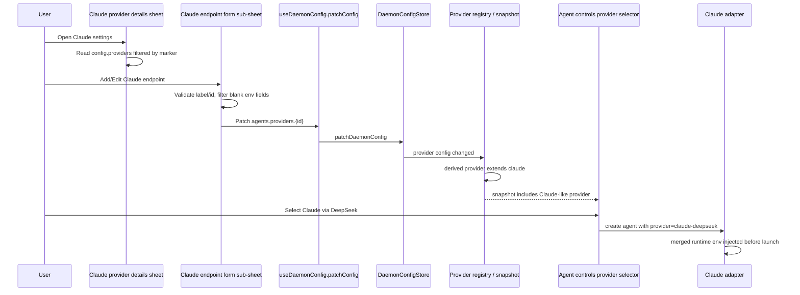

# claude-endpoint-variants design

## 0. Terminology

| Term                        | Definition                                                                                                                                                                         | Anti-conflict conclusion                                                                                                                                                                                                              |
| --------------------------- | ---------------------------------------------------------------------------------------------------------------------------------------------------------------------------------- | ------------------------------------------------------------------------------------------------------------------------------------------------------------------------------------------------------------------------------------- |
| **Provider**                | Agent backend such as Claude Code, Codex, OpenCode, Pi. Existing glossary says UI label is "Provider".                                                                             | Do not rename Claude endpoint variants to generic "custom providers" in UI. They may be implemented through provider overrides, but the user-facing feature is Claude-specific.                                                       |
| **Claude endpoint variant** | A user-configured Claude Code launch profile that appears as a named Claude-like provider option and injects Anthropic-compatible endpoint env vars at agent creation/resume time. | Canonical term already recorded in `.bytetrue/reference/domain-context.md`. It is backed by the Claude adapter and is not a runtime model switch.                                                                                     |
| **Internal ID**             | The lowercase provider id stored under `agents.providers.{id}`.                                                                                                                    | Hidden by default. Auto-generated from display name on create; editable only in Advanced before creation; read-only on edit.                                                                                                          |
| **Managed marker**          | Internal config marker identifying UI-managed Claude endpoint variants.                                                                                                            | Use a marker such as `params.paseoManagedKind: "claudeEndpointVariant"` so the UI does not edit hand-written advanced `extends: "claude"` overrides.                                                                                  |
| **Endpoint env fields**     | The six optional Claude Code env vars exposed by the form.                                                                                                                         | Exactly: `ANTHROPIC_BASE_URL`, `ANTHROPIC_AUTH_TOKEN`, `ANTHROPIC_DEFAULT_OPUS_MODEL`, `ANTHROPIC_DEFAULT_SONNET_MODEL`, `ANTHROPIC_DEFAULT_HAIKU_MODEL`, `CLAUDE_CODE_SUBAGENT_MODEL`. `ANTHROPIC_MODEL` is explicitly out of scope. |

## 1. Decisions and Constraints

### Requirement summary

Build a Claude-only UI for adding, editing, and deleting Anthropic-compatible endpoint launch profiles. A user should be able to open the Claude provider details sheet, add a named endpoint such as "Claude via DeepSeek", fill the six structured env fields, save it, and then select that variant as a Claude-like provider when creating agents.

Success means:

- The old generic front-end "Add custom provider" path remains removed.
- `Claude` settings show a `Claude endpoints` section above discovered models.
- Multiple UI-managed Claude endpoint variants can be added, edited, and deleted.
- Saved variants are persisted in daemon config as `extends: "claude"` provider overrides with a managed marker.
- Agent creation uses the existing derived-provider path, so a selected variant behaves like Claude with the configured env overlay.
- Variants visually read as Claude variants in provider selection, not as unknown bot providers.

Explicit non-goals:

- No generic custom-provider UI and no `Base provider` picker.
- No Codex, OpenCode, Pi, ACP, command, params, API type, context window, or vision configuration in this feature.
- No endpoint test/validation button and no save-time network probe.
- No `ANTHROPIC_MODEL` field.
- No raw environment-variable table in the main path.
- No runtime switching of an already-running agent from one endpoint variant to another.
- No encrypted/secure-at-rest secret store change; this follows the current daemon `config.json` storage model.
- Do not edit or list hand-written `extends: "claude"` overrides unless they carry the UI-managed marker.

### Complexity dimension

Use the internal project tooling default bundle, with these explicit dimensions:

- **Robustness = L3 hardened for config input**: provider ids, labels, and env values are user input persisted into daemon config. Validate id format, duplicate ids, required display name, and delete confirmation paths.
- **Structure = modules**: the UI form and patch-building logic should live outside the already-large provider details sheet; the sheet only mounts sections/sub-sheets.
- **Compatibility = backward-compatible**: any protocol additions must be optional. Old clients continue parsing provider snapshots; old daemons simply do not expose Claude endpoint management metadata.
- **Security = validated, not encrypted**: mask the API key in the UI by default and allow eye-toggle reveal, but do not introduce new credential storage semantics.

### Execution mode

```yaml
execution_mode:
  level: standard
  triggers: [normal-feature, cross-boundary-contract]
  required_evidence: [lint-or-typecheck, regression-test, manual-check, spec-compliance-review]
```

This crosses app UI, daemon config persistence, provider snapshot metadata, and provider selection rendering. It is not a quick UI-only change.

### Key decisions

1. **Reuse derived Claude provider overrides underneath, but expose a Claude-specific UI.**
   - Chosen: write `agents.providers.{internalId}` with `extends: "claude"`, `label`, filtered `env`, optional `disallowedTools`, and the managed marker.
   - Rejected: a generic custom provider form. That is the path that caused the UX mismatch.

2. **The Claude sheet is the management home.**
   - Chosen: add `Claude endpoints` above `Discovered` in the existing Claude provider details sheet.
   - Rejected: global `Add provider`, because it suggests a generic provider abstraction.

3. **Endpoint variants appear as independent Claude-like provider rows for agent creation.**
   - Chosen: provider selector shows `Claude`, `Claude via DeepSeek`, etc.; variants use Claude visual treatment.
   - Rejected: hiding endpoints under Claude's model list. Claude endpoint switching is launch-env scoped, not model-only scoped.

4. **Create supports hidden Advanced ID; edit makes ID read-only.**
   - Create: display name generates an internal id; Advanced can override before save.
   - Edit: internal id is displayed read-only to avoid breaking old agent/provider references.

5. **All six env fields are optional and omitted when blank.**
   - If every field is blank, the derived provider behaves like normal Claude except for its label/identity.
   - `ANTHROPIC_MODEL` is not generated or shown.

6. **No endpoint testing.**
   - Save is local config write only. Provider snapshot refresh / agent creation surfaces real failures the same way built-in providers do.

7. **Managed marker protects advanced hand-written config.**
   - The UI filters on `params.paseoManagedKind === "claudeEndpointVariant"` before listing/editing endpoints.
   - Hand-written `extends: "claude"` entries can still exist as providers, but they are not edited by this form.

8. **WebSearch handling is automatic, not a first-version form choice.**
   - Assumption for review: UI-managed Claude endpoint variants should continue to set `disallowedTools: ["WebSearch"]` by default because documented third-party Anthropic-compatible endpoints generally do not support Anthropic server-side WebSearch.
   - This is not exposed as a user-facing field in v1; if this assumption is wrong, revise it before approval.

## 2. Terms and Orchestration

### 2.1 Term Layer

#### Current state

- `ProviderOverrideSchema` already accepts `extends`, `label`, `description`, `env`, `params`, `models`, `additionalModels`, `disallowedTools`, `enabled`, and `order` (`packages/protocol/src/provider-config.ts:46`). Non-built-in provider overrides must declare `extends` and `label`, and valid `extends` values include built-ins such as `claude` (`packages/protocol/src/provider-config.ts:63`).
- Mutable daemon config already stores `providers` and accepts passthrough provider config fields in patches (`packages/protocol/src/messages.ts:98`, `packages/protocol/src/messages.ts:174`).
- `applyMutableProviderConfigToOverrides` strips and parses mutable provider config into persisted provider overrides, and `removeProviders` writes tombstones before persistence (`packages/server/src/server/daemon-config-store.ts:107`).
- `addDerivedProviders` already resolves any non-built-in override that extends `claude` through the base Claude factory, merging runtime settings and setting `derivedFromProviderId` internally (`packages/server/src/server/agent/provider-registry.ts:562`).
- Provider snapshots currently expose label, description, default mode, canRemove, models, modes, and status (`packages/protocol/src/messages.ts:271`), and the snapshot manager builds entries from provider definitions (`packages/server/src/server/agent/provider-snapshot-manager.ts:661`). The internal `derivedFromProviderId` is not currently serialized to the app.
- Provider icons are resolved by provider id only: built-in ids map to specific icons, catalog ids map to ACP catalog icons, otherwise the app falls back to `Bot` (`packages/app/src/components/provider-icon-name.ts:31`, `packages/app/src/components/provider-icons.ts:62`).
- The provider details sheet currently handles discovered models, additional custom models, diagnostic, and refresh. It has `AddCustomModelSubSheet`, `DiagnosticSubSheet`, `ProviderModalBody`, and footer actions in one large file (`packages/app/src/components/provider-diagnostic-sheet.tsx:138`, `packages/app/src/components/provider-diagnostic-sheet.tsx:231`, `packages/app/src/components/provider-diagnostic-sheet.tsx:428`, `packages/app/src/components/provider-diagnostic-sheet.tsx:508`).

#### Change

Add a first-class **Claude endpoint variant** config convention on top of the existing provider override shape:

```ts
// source: packages/protocol/src/provider-config.ts ProviderOverrideSchema-compatible shape
const claudeEndpointVariantProvider = {
  extends: "claude",
  label: "Claude via DeepSeek",
  description: "Claude endpoint",
  env: {
    ANTHROPIC_BASE_URL: "https://api.deepseek.com/anthropic",
    ANTHROPIC_AUTH_TOKEN: "...",
    ANTHROPIC_DEFAULT_OPUS_MODEL: "deepseek-v4-pro[1m]",
    ANTHROPIC_DEFAULT_SONNET_MODEL: "deepseek-v4-pro[1m]",
    ANTHROPIC_DEFAULT_HAIKU_MODEL: "deepseek-v4-flash",
    CLAUDE_CODE_SUBAGENT_MODEL: "deepseek-v4-flash",
  },
  disallowedTools: ["WebSearch"],
  params: { paseoManagedKind: "claudeEndpointVariant" },
};
```

Blank env fields are filtered before patching; a blank field means the corresponding env var is absent.

Add optional provider-snapshot metadata so app code can render derived providers correctly without guessing from ids:

```ts
// source: packages/protocol/src/agent-types.ts ProviderSnapshotEntry
interface ProviderSnapshotEntry {
  provider: string;
  // existing fields...
  derivedFromProviderId?: string | null;
  managedKind?: "claudeEndpointVariant" | string;
}
```

- `derivedFromProviderId` is optional and backward-compatible. For a Claude endpoint variant it is `"claude"`.
- `managedKind` is derived from `params.paseoManagedKind` and lets UI distinguish UI-managed variants from hand-written overrides.
- The app's provider selection model should carry an optional icon/base-provider hint so `Claude via DeepSeek` can use the Claude icon while retaining its own provider id.

Add app-side helper types/functions for the structured form:

```ts
// source: new app helper module, exact file chosen by implement
interface ClaudeEndpointVariantFormValues {
  internalId: string;
  label: string;
  env: {
    ANTHROPIC_BASE_URL?: string;
    ANTHROPIC_AUTH_TOKEN?: string;
    ANTHROPIC_DEFAULT_OPUS_MODEL?: string;
    ANTHROPIC_DEFAULT_SONNET_MODEL?: string;
    ANTHROPIC_DEFAULT_HAIKU_MODEL?: string;
    CLAUDE_CODE_SUBAGENT_MODEL?: string;
  };
}

function buildClaudeEndpointVariantPatch(
  values: ClaudeEndpointVariantFormValues,
): MutableDaemonConfigPatch;
function isClaudeEndpointVariant(providerConfig: unknown): boolean;
function generateClaudeEndpointInternalId(label: string, existingIds: Set<string>): string;
```

Interface examples:

```ts
// source: new app helper module buildClaudeEndpointVariantPatch
buildClaudeEndpointVariantPatch({
  internalId: "claude-deepseek",
  label: "Claude via DeepSeek",
  env: {
    ANTHROPIC_BASE_URL: "https://api.deepseek.com/anthropic",
    ANTHROPIC_AUTH_TOKEN: "sk-...",
    ANTHROPIC_DEFAULT_OPUS_MODEL: "deepseek-v4-pro[1m]",
    ANTHROPIC_DEFAULT_SONNET_MODEL: "deepseek-v4-pro[1m]",
    ANTHROPIC_DEFAULT_HAIKU_MODEL: "deepseek-v4-flash",
    CLAUDE_CODE_SUBAGENT_MODEL: "deepseek-v4-flash",
  },
});
// → { providers: { "claude-deepseek": { extends: "claude", label, env, disallowedTools: ["WebSearch"], params: { paseoManagedKind: "claudeEndpointVariant" } } } }
```

```ts
// source: new app helper module buildClaudeEndpointVariantPatch
buildClaudeEndpointVariantPatch({
  internalId: "claude-empty",
  label: "Claude empty",
  env: { ANTHROPIC_BASE_URL: "", ANTHROPIC_AUTH_TOKEN: "  " },
});
// → env omitted entirely; no blank env vars are written
```

### 2.2 Orchestration Layer



#### Current state

- Host settings shows providers from `buildProviderDefinitions(entries)` and opens provider details through `useProviderSettingsStore.open({ serverId, provider })` (`packages/app/src/screens/settings/providers-section.tsx:481`, `packages/app/src/screens/settings/providers-section.tsx:488`).
- The global `Add provider` section is reserved for ACP catalog installation through `ProviderCatalogList` (`packages/app/src/screens/settings/providers-section.tsx:612`). The reverted generic custom-provider form must not return there.
- `ProviderDiagnosticSheet` receives one provider id, reads the provider snapshot and daemon config, ranks discovered and additional models, and renders a modal sheet with model list plus footer actions (`packages/app/src/components/provider-diagnostic-sheet.tsx:508`).
- Config writes already go through `useDaemonConfig.patchConfig`, which calls `client.patchDaemonConfig` and updates the query cache (`packages/app/src/hooks/use-daemon-config.ts:51`).
- Daemon config changes rebuild provider registry snapshots without spawning provider processes except through explicit refresh paths, per architecture docs provider snapshot contract (`.bytetrue/architecture/providers.md`).

#### Change

1. **Claude sheet loads endpoint variants**
   - Only when `provider === "claude"`, compute endpoint variants from `config.providers` where `extends === "claude"` and `params.paseoManagedKind === "claudeEndpointVariant"`.
   - Search should match endpoint label, internal id, and base URL in addition to model rows. The placeholder may become `Search models and endpoints` only for the Claude sheet.

2. **Claude endpoints section appears above Discovered models**
   - Section title: `Claude endpoints`.
   - Section header owns `+ Add endpoint` action; do not add a fourth footer button.
   - Empty state: short, quiet copy plus `Add endpoint` action.
   - Rows show display name, internal id, base URL (if present), and a subtle `Claude endpoint` badge or description. API key is never shown in the row.

3. **Add/Edit form is an AdaptiveModalSheet sub-sheet**
   - Add mode fields: Display name, six env fields, Advanced/Internal ID, Save/Cancel.
   - Edit mode fields: same env fields, API key prefilled but masked by default with eye toggle, Internal ID read-only.
   - The form owns inline validation errors. Save failures surface as inline error or `Alert.alert("Unable to save endpoint", ...)` if the failure is not field-local.

4. **Save writes a provider override patch**
   - Create writes `providers[internalId]`.
   - Edit patches the same id and preserves marker; id cannot change.
   - Delete calls `removeProviders: [internalId]` after a destructive confirm.
   - After create/delete, refresh the affected provider id(s). No broad settings refresh or network test.

5. **Provider selector renders Claude-like variants**
   - Provider snapshot entries for derived Claude endpoint variants include optional metadata.
   - App provider selection/icon utilities use `derivedFromProviderId === "claude"` to render the Claude icon and variant description while keeping the variant's provider id for launch.

#### Flow-level constraints

- **Idempotency**: saving an edit to the same internal id overwrites only the UI-managed fields and keeps the marker. Creating with a duplicate id is blocked in the form.
- **Blank env semantics**: blank or whitespace-only env field means omit the key. It does not write an empty string.
- **Delete semantics**: deletion removes the provider override. Warn that agents or preferences referring to this endpoint may need another provider selected before reuse/resume.
- **Compatibility**: new snapshot fields are optional. Existing clients ignore them; existing daemons simply do not expose managed-kind metadata.
- **No validation side effects**: save does not test credentials, model ids, or endpoint URL.
- **Advanced override protection**: the Claude endpoints section only lists entries with the managed marker. It does not infer from `extends: "claude"` alone.
- **Provider refresh scope**: use targeted refresh for created provider ids. Do not fan out to all cwd scopes.

### 2.3 Mount-Point Inventory

| Mount point                 | Location                                                       | Action                                                                                                                     |
| --------------------------- | -------------------------------------------------------------- | -------------------------------------------------------------------------------------------------------------------------- |
| Daemon config shape         | `$PASEO_HOME/config.json` path `agents.providers.{internalId}` | add UI-managed Claude endpoint variant convention using existing provider override fields plus marker                      |
| Provider snapshot metadata  | `ProviderSnapshotEntry` schema/payload                         | add optional `derivedFromProviderId` and `managedKind` so clients can render Claude variants without guessing              |
| Claude provider settings UI | `ProviderDiagnosticSheet` for `provider === "claude"`          | add `Claude endpoints` section and Add/Edit/Delete sub-sheet mount                                                         |
| Provider selection visuals  | provider selector/icon utilities                               | modify to render derived Claude endpoint variants with Claude icon/variant description while preserving launch provider id |
| Global Add provider surface | Settings `Add provider` section                                | keep generic custom provider UI removed; do not mount this feature there                                                   |

### 2.4 Rollout Strategy

1. **Protocol/config skeleton**: add optional snapshot metadata and UI-managed Claude endpoint helpers without changing behavior.
   - Exit signal: typecheck passes; provider snapshots without metadata still parse.
2. **Static Claude endpoints UI**: add the Claude-only section, empty state, row layout, and sub-sheet form using local placeholder data.
   - Exit signal: opening the Claude sheet shows the section above Discovered models and matches the existing modal/card rhythm.
3. **Config integration**: connect add/edit/delete to daemon config patching with marker filtering, id generation, blank-env filtering, API key masking, and delete confirmation.
   - Exit signal: config patches match the agreed provider override shape and the list updates from real daemon config.
4. **Provider selector visual integration**: expose/consume derived provider metadata so endpoint variants render as Claude-like providers.
   - Exit signal: a UI-managed variant appears as a selectable provider row with Claude visual treatment and launches by provider id.
5. **Tests and verification**: cover pure helpers, config patch behavior, provider snapshot metadata, and component interactions; run focused tests plus lint/typecheck.
   - Exit signal: acceptance scenarios have automated or manual evidence.

### 2.5 Structural Health and Micro-refactor

##### Evaluation

- file level — `packages/app/src/components/provider-diagnostic-sheet.tsx`: 819 lines and already mixes model list rendering, add-model form, diagnostic sub-sheet, footer, search, config patching, and modal orchestration. Adding Claude endpoint form inline would create a god component.
- file level — `packages/app/src/screens/settings/providers-section.tsx`: 723 lines but this feature should only keep the old generic custom provider mount removed; no new endpoint UI belongs here.
- file level — `packages/server/src/server/agent/provider-registry.ts` and `provider-snapshot-manager.ts`: large but the required change is narrow metadata propagation; do not split during this feature.
- directory level — `packages/app/src/components`: 110 files at top level, already crowded. Adding multiple provider-settings components directly here would worsen flattening.
- directory level — `packages/app/src/screens/settings`: 9 files; do not add the endpoint form here because the current provider details sheet is a reusable component, not a settings screen section.
- directory level — `packages/app/src/hooks`: 100 files; avoid adding a hook if the logic is pure helper functions local to provider settings.

##### Conclusion: do not refactor existing files this time; contain new code in a new provider-settings subdirectory

No move-only micro-refactor is required before the feature. The existing provider sheet is large, but moving it now would add noise and import churn before a behavior change. The feature should instead add new code under a new directory such as `packages/app/src/components/provider-settings/` and keep `provider-diagnostic-sheet.tsx` as a thin mount point for the new Claude endpoints section/sub-sheet.

##### Observations beyond scope

- `provider-diagnostic-sheet.tsx` is already a candidate for later refactor into provider settings modules. This feature should not do a broad split unless the implementation cannot keep the endpoint code isolated.

## 3. Acceptance Contract

### Key scenarios

| #   | Scenario                                                                    | Expected observable result                                                                                                                                                                                             |
| --- | --------------------------------------------------------------------------- | ---------------------------------------------------------------------------------------------------------------------------------------------------------------------------------------------------------------------- |
| 1   | Open Claude provider details with no managed variants                       | A `Claude endpoints` section appears above `Discovered`, with a quiet empty state and `Add endpoint` action.                                                                                                           |
| 2   | Add endpoint with display name `Claude via DeepSeek` and all six env fields | Daemon config gains `agents.providers.{generatedId}` with `extends: "claude"`, label, filtered env, managed marker, and default WebSearch disallow assumption; provider snapshot/selector shows a Claude-like variant. |
| 3   | Add endpoint with some env fields blank                                     | Blank env vars are omitted from config; nonblank fields are persisted exactly after trim.                                                                                                                              |
| 4   | Add endpoint with all env fields blank                                      | A provider override is still created, but it has no `env` object and behaves like normal Claude except for name/identity.                                                                                              |
| 5   | Edit an existing managed endpoint                                           | Form opens with current values, API key is masked by default and revealable with an eye toggle; save updates the same provider id.                                                                                     |
| 6   | Attempt to edit Internal ID                                                 | In edit mode, Internal ID is read-only and cannot be changed.                                                                                                                                                          |
| 7   | Create with duplicate Internal ID                                           | Inline validation blocks save with a clear duplicate-id error.                                                                                                                                                         |
| 8   | Delete a managed endpoint                                                   | Destructive confirm appears; confirming removes the provider override and the variant disappears from the section and provider selection.                                                                              |
| 9   | Hand-written `extends: "claude"` provider without marker exists             | It may still appear as a provider, but it does not appear in the Claude endpoints management section and cannot be edited by this form.                                                                                |
| 10  | User searches in Claude sheet                                               | Matching endpoints and models remain visible; nonmatching endpoints/models are hidden.                                                                                                                                 |
| 11  | Select `Claude via DeepSeek` when creating an agent                         | Agent creation uses provider id for that variant; underlying server path still routes through the Claude adapter with merged runtime env.                                                                              |
| 12  | Save endpoint                                                               | No network validation/test is performed. Failures appear later through normal provider refresh or agent creation error surfaces.                                                                                       |

### Reverse-check items for explicit non-goals

- No `Add custom provider` button or generic custom provider form appears in the global `Add provider` section.
- No `Base provider` field or generic provider inheritance UI exists in the Claude endpoint form.
- No Codex/OpenCode/Pi endpoint section is added.
- No `ANTHROPIC_MODEL` string appears as a form field or generated env key.
- No endpoint test/validation RPC or `Test endpoint` button is added.
- No raw key-value env table appears in the main form.
- No runtime set-model path attempts to switch endpoint env for an already-running agent.

### 3.1 Test Seam / TDD Plan

- **TDD applicability**: applicable. The risky parts are pure config transformation, marker filtering, id generation, and protocol metadata propagation; all are testable without launching real Claude.
- **Highest behavior seam**: app helper + daemon/provider snapshot boundary.
- **Priority red/green behaviors**:
  1. `buildClaudeEndpointVariantPatch` filters blank env fields and emits the exact provider override shape with marker.
  2. filtering logic returns only `extends: "claude"` + managed marker entries, not hand-written derived providers.
  3. provider snapshot metadata for a derived Claude endpoint carries `derivedFromProviderId: "claude"` / `managedKind`, and app icon selection uses Claude visuals.
- **Manual verification items**:
  - Visual check of the Claude sheet layout against the screenshot: endpoints section above Discovered, footer unchanged.
  - Add/edit form key masking and eye toggle.
  - Provider selector shows the variant as Claude-like.

### 3.2 Behavior Delta

ADDED:

- Claude provider details gains `Claude endpoints` section with add/edit/delete management.
- UI-managed Claude endpoint variants can be selected as Claude-like providers for new agents.
- Provider snapshots may include optional derived-provider metadata for client rendering.

MODIFIED:

- Provider icon/selection rendering uses derived-provider metadata when available instead of relying only on provider id.
- Claude provider settings search includes endpoints as well as models.

REMOVED:

- The previously added generic front-end `Add custom provider` entry remains removed and must not be reintroduced.

## 4. Relationship with Project-Level Architecture Docs

- **terms**: `Claude endpoint variant` has already been recorded in `.bytetrue/reference/domain-context.md`; acceptance should verify the term still matches implementation.
- **verb skeleton**: `.bytetrue/architecture/custom-providers.md` should be updated after implementation to describe the UI-managed Claude endpoint variant convention as a constrained layer over existing provider overrides.
- **flow-level constraints**: `.bytetrue/architecture/providers.md` should mention that provider snapshot entries may expose optional derived-provider metadata for client rendering, without changing provider probing semantics.
- **user/developer docs**: `docs/custom-providers.md` should be updated or split so ordinary users see the Claude endpoint variant UI path before raw config examples. The raw `extends` examples remain advanced docs.
- **top-level architecture entry**: no new top-level subsystem is required; this is within existing provider configuration and daemon-synced settings.
